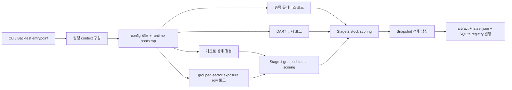
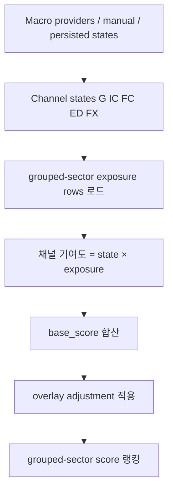
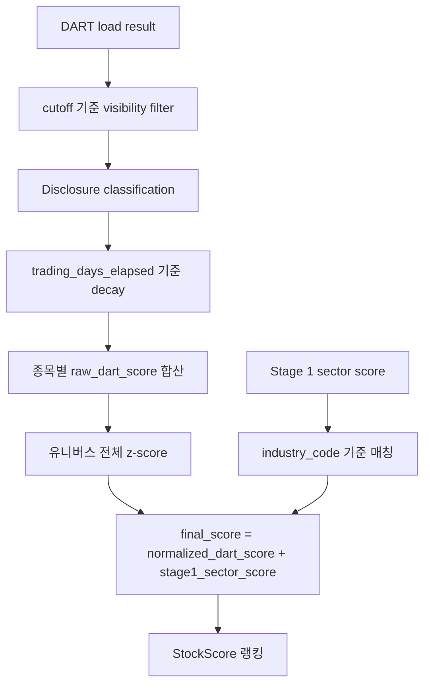
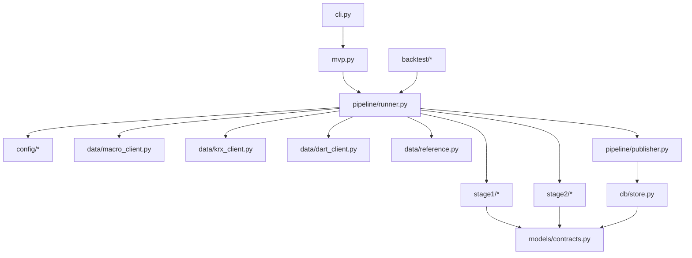

# macro-screener

[English version](README.md)

`macro-screener`는 한국 보통주 유니버스를 대상으로 하는 배치형 주식 스크리너입니다.
현재 코드베이스는 **sector-v2** 런타임을 구현하고 있으며 다음 순서로 동작합니다.

1. 매크로 채널 상태를 결정하고,
2. 이를 **grouped sector** 점수로 변환하고,
3. 전체 종목 유니버스에 대해 DART 공시 점수를 계산하고,
4. 종목별로 Stage 1 섹터 문맥 점수를 더한 뒤,
5. immutable snapshot과 레지스트리 메타데이터를 발행합니다.

이 README는 단순 quickstart보다 더 넓은 문맥을 설명하기 위한 문서입니다.
즉 다음을 설명합니다.
- 어떤 데이터를 쓰는지,
- 각 provider가 어디에 들어가는지,
- 점수가 어떻게 계산되는지,
- 런타임이 코드에서 어떻게 흐르는지,
- 출력과 상태가 어디에 저장되는지,
- 더 깊은 문맥이 필요할 때 무엇을 읽어야 하는지.

다른 엔지니어나 에이전트에게 전달할 핵심 문서 세트는 다음입니다.
- `doc/program-context.md`
- `doc/repository-orientation.md`
- `doc/code-context.md`

---

## 1. 이 프로그램이 하는 일과 하지 않는 일

이 저장소는 **snapshot-publishing screener** 입니다.
섹터와 종목을 랭킹해서 결과를 발행하지만, 포트폴리오 비중 결정이나 주문 실행은 하지 않습니다.

현재 범위:
- 한국 주식 스크리닝
- KOSPI + KOSDAQ 보통주 유니버스
- batch/manual/scheduled 실행
- backtest 실행
- immutable snapshot 산출물 발행
- grouped-sector 기반 Stage 1 점수 계산
- DART 기반 Stage 2 종목 점수 계산

범위 밖:
- 포트폴리오 구성
- 주문 실행
- 실시간 모니터링 서비스
- 뉴스/NLP 해석 레이어
- 현재 Korea/US 범위를 넘는 글로벌 매크로 커버리지

---

## 2. 상위 런타임 모델

런타임 오케스트레이션은 `src/macro_screener/pipeline/runner.py`에 있습니다.
상위 흐름은 다음과 같습니다.



주요 명령:
- `show-config`
- `demo-run`
- `manual-run`
- `scheduled-run`
- `backtest-run`
- `backtest-stub`

주요 코드 경로:
- CLI: `src/macro_screener/cli.py`
- 런타임 오케스트레이션: `src/macro_screener/pipeline/runner.py`
- 산출물 발행: `src/macro_screener/pipeline/publisher.py`
- 매크로 어댑터: `src/macro_screener/data/macro_client.py`
- KRX 유니버스 어댑터: `src/macro_screener/data/krx_client.py`
- DART 어댑터: `src/macro_screener/data/dart_client.py`
- taxonomy/exposure helper: `src/macro_screener/data/reference.py`
- Stage 1 점수 계산: `src/macro_screener/stage1/ranking.py`
- Stage 2 점수 계산: `src/macro_screener/stage2/ranking.py`

---

## 3. 현재 모델 요약

### Stage 1
Stage 1은 다음 5개 채널 상태를 사용합니다.
- `G` — Growth / Activity
- `IC` — Inflation / Cost
- `FC` — Financial Conditions
- `ED` — External Demand
- `FX` — Foreign Exchange

현재 코드베이스는 다음을 사용합니다.
- 설정 버전: `sector-v2`
- grouped-sector exposure artifact: `config/macro_sector_exposure.v2.json`
- grouped-sector taxonomy helper: `src/macro_screener/data/reference.py`
- 활성 점수 계산 방식: **채널 상태 × grouped-sector exposure 직접 곱셈**

호환성 주의:
- 모델과 파일명에 `industry_*` 이름이 여전히 남아 있지만,
- 실제 비즈니스 개념은 이제 예전 rank-table industry가 아니라 **grouped sector** 입니다.

### Stage 2
Stage 2는:
- **전체 종목 유니버스**를 대상으로 동작하고,
- DART 공시 이벤트를 분류하고,
- 거래일 기준 decay를 적용하고,
- 종목별 raw DART score를 합산하고,
- 유니버스 전체에서 z-score 정규화한 뒤,
- 해당 종목의 Stage 1 sector score를 더합니다.

현재 최종 점수 계약:

```text
final_score = normalized_dart_score + stage1_sector_score
```

호환성 주의:
- `normalized_financial_score` 필드는 모델 계약에 남아 있지만,
- 현재 Stage 2 런타임에서는 `0.0`으로 고정됩니다.

---

## 4. 데이터 소스와 각 소스의 역할

### 4.1 매크로 provider

| Provider | 현재 코드에서의 역할 | 사용 목적 | 런타임 상태 |
|---|---|---|---|
| `ECOS` | 한국 매크로/통계 소스 | 한국측 macro channel series | active |
| `FRED` | 미국 매크로 소스 | 미국측 macro channel series | active |
| `KOSIS` | 선택적 한국 통계 소스 | 외부수요 live path의 선택적 보강 | conditional |
| `ALFRED` | 미국 historical/vintage 경로 | historical/backfill 지원 | partial / planned |
| `BIS` | 메인 런타임 비사용 | 참고 / 향후 확장 | inactive |
| `OECD` | 메인 런타임 비사용 | 참고 / 향후 확장 | inactive |
| `IMF` | 메인 런타임 비사용 | 참고 / 향후 확장 | inactive |

### 4.2 시장 / 유니버스 provider

| Provider | 역할 | 사용 목적 | 런타임 상태 |
|---|---|---|---|
| `KRX` | 시장/유니버스 provider | live stock master, 종목 유니버스 구성, taxonomy join | active |

### 4.3 공시 provider

| Provider | 역할 | 사용 목적 | 런타임 상태 |
|---|---|---|---|
| `DART` | 공시 provider | Stage 2 공시 로드, cursor/cache 상태 관리 | active |

### 4.4 로컬 reference 입력

| 로컬 파일 | 목적 |
|---|---|
| `config/default.yaml` | 런타임 기본값, 정책, 경로, decay 파라미터 |
| `config/macro_sector_exposure.v2.json` | Stage 1 grouped-sector exposure artifact |
| `stock_classification.csv` | 로컬 종목 분류 authority |
| `data/reference/industry_master.csv` | classification으로부터 생성되는 grouped-sector reference artifact |

---

## 5. 매크로 데이터 사용 방식과 채널 구성

매크로 레이어는 `src/macro_screener/data/macro_client.py`에 정의되어 있습니다.
코드는 `FIXED_CHANNEL_SERIES_ROSTER`와 `FIXED_SERIES_CLASSIFIER_SPECS`를 통해 고정된 시리즈 묶음과 분류 기준을 관리합니다.

### 5.1 채널 roster

| 채널 | 한국측 시리즈 | 미국측 시리즈 | degraded fallback |
|---|---|---|---|
| `G` | `kr_ipi_yoy_3mma` | `us_ipi_yoy_3mma` | 없음 |
| `IC` | `kr_cpi_yoy_3mma` | `us_cpi_yoy_3mma` | 없음 |
| `FC` | `kr_credit_spread_z36` | `us_credit_spread_z36` | 없음 |
| `ED` | `kr_exports_us_yoy_3mma` | `us_real_imports_goods_yoy_3mma` | `us_real_pce_goods_yoy_3mma` |
| `FX` | `usdkrw_3m_log_return` | `broad_usd_3m_log_return` | 없음 |

### 5.2 고정 분류 cutoff

| 시리즈 | positive cutoff | negative cutoff | positive 의미 |
|---|---:|---:|---|
| `kr_ipi_yoy_3mma` | `1.0` | `-1.0` | higher |
| `us_ipi_yoy_3mma` | `1.0` | `-1.0` | higher |
| `kr_cpi_yoy_3mma` | `2.75` | `1.25` | higher |
| `us_cpi_yoy_3mma` | `2.75` | `1.25` | higher |
| `kr_credit_spread_z36` | `-0.5` | `0.5` | lower |
| `us_credit_spread_z36` | `-0.5` | `0.5` | lower |
| `kr_exports_us_yoy_3mma` | `2.0` | `-2.0` | higher |
| `us_real_imports_goods_yoy_3mma` | `1.5` | `-1.5` | higher |
| `us_real_pce_goods_yoy_3mma` | `1.5` | `-1.5` | higher |
| `usdkrw_3m_log_return` | `2.5` | `-2.5` | higher |
| `broad_usd_3m_log_return` | `2.0` | `-2.0` | higher |

### 5.3 채널 상태 계산 방식

각 시리즈 값은 먼저 `-1 / 0 / +1`로 분류됩니다.
그 다음 같은 채널 내 시그널을 산술평균하고, `DEFAULT_NEUTRAL_BANDS`와 비교해 최종 채널 상태를 정합니다.

개념적으로는 다음과 같습니다.

```text
combined_score_c = average(signal_state_i for series in channel c)
state_c = +1 if combined_score_c > neutral_band_c
state_c =  0 if -neutral_band_c <= combined_score_c <= neutral_band_c
state_c = -1 if combined_score_c < -neutral_band_c
```

현재 neutral band:
- `G`: `0.25`
- `IC`: `0.25`
- `FC`: `0.25`
- `ED`: `0.25`
- `FX`: `0.50`

### 5.4 매크로 source 선택 동작

런타임은 다음 소스 중 하나에서 채널 상태를 결정할 수 있습니다.
- 명시적 manual override
- config에 적힌 manual state
- persisted last-known channel state
- live provider payload

현재 runner 구현상:
- `manual-run`은 별도 override가 없으면 live/provider 경로를 기본 사용
- `scheduled-run`도 live/provider 경로 사용
- demo 모드는 내장 demo state 사용
- fallback metadata는 중립으로 숨기지 않고 metadata/warning으로 보존

---

## 6. Stage 1 grouped-sector 점수 계산

grouped-sector roster와 exposure matrix는 `src/macro_screener/data/reference.py`에 있습니다.
KRX 어댑터는 `config/macro_sector_exposure.v2.json`을 읽고 채널/섹터 커버리지를 검증한 뒤 Stage 1 exposure row로 변환합니다.

### 6.1 Stage 1 row 구성
각 grouped-sector row는 다음을 가집니다.
- `industry_code` (legacy-compatible 이름)
- `industry_name`
- `exposures` keyed by `G`, `IC`, `FC`, `ED`, `FX`

### 6.2 현재 활성 점수 계산 방식

`src/macro_screener/stage1/ranking.py`는 다음을 계산합니다.
1. 채널별 channel score map 생성
2. 채널 기여도 = `channel_state × sector_exposure[channel]`
3. base score = 모든 채널 기여도 합
4. `src/macro_screener/stage1/overlay.py`의 overlay adjustment 적용
5. final score = `base_score + overlay_adjustment`
6. final score와 tie-breaker 기준으로 랭킹

개념적으로:

```text
sector_base_score = Σ(channel_state[c] * sector_exposure[c])
sector_final_score = sector_base_score + overlay_adjustment
```

### 6.3 Stage 1 흐름



---

## 7. 종목 유니버스 데이터 사용 방식

종목 유니버스 로직은 `src/macro_screener/data/krx_client.py`에 있습니다.

런타임은 다음 소스에서 종목 row를 만들 수 있습니다.
- live KRX master-download 데이터
- `stock_classification.csv` 기반 taxonomy-only fallback
- demo 모드에서 demo fallback

### 7.1 유니버스 구성 방식

live 경로는:
1. live stock-master row를 가져오고,
2. 이를 normalize 하고,
3. 로컬 stock classification mapping과 join 하고,
4. ETF/ETN/REIT/SPAC 등 비보통주 패턴을 제거하고,
5. `stock_code`, `stock_name`, `industry_code`, `industry_name` row를 만듭니다.

### 7.2 taxonomy mapping 동작

grouped-sector mapping은 `src/macro_screener/data/reference.py`의 `map_classification_row_to_grouped_sector(...)`에서 수행됩니다.

실무상 caveat:
- grouped-sector roster 자체는 26개 섹터를 정의하지만,
- 실제 `industry_master.csv` materialization은 classification 파일에 따라 더 적은 row를 가질 수 있습니다.
- 즉 정의된 grouped sector가 모두 현재 materialized master에 등장한다고 보장되지는 않습니다.

### 7.3 특수 override
KRX 어댑터에는 taxonomy row가 없을 때 sector를 보정하기 위한 아주 작은 `STOCK_CODE_SECTOR_OVERRIDES` 맵이 있습니다.

---

## 8. DART 데이터 사용과 Stage 2 계산

DART 관련 로직은 다음에 흩어져 있습니다.
- `src/macro_screener/data/dart_client.py`
- `src/macro_screener/stage2/classifier.py`
- `src/macro_screener/stage2/decay.py`
- `src/macro_screener/stage2/ranking.py`

### 8.1 DART load mode

DART client는 다음 경로를 지원합니다.
- 허용된 경우 local file input
- structured cursor를 사용하는 live API pagination
- 허용된 경우 stale cache fallback
- live path가 없을 때 demo fallback

### 8.2 cursor와 cutoff 동작

live DART 경로는:
- `https://opendart.fss.or.kr/api/list.json`를 페이지네이션하고,
- 각 항목을 종목/이벤트 레코드로 normalize 하고,
- 현재 cutoff 기준 `accepted_at`을 계산하고,
- `input_cutoff` 시점에 visible 한 공시만 남기고,
- `accepted_at`, `input_cutoff`, `rcept_dt`, `rcept_no`를 포함한 structured cursor를 저장합니다.

즉 단순히 “당일 공시 전부 로드”가 아니라 cutoff-aware 경로입니다.

### 8.3 공시 분류 규칙

classifier는 event code와 title pattern을 사용해 다음 block으로 분류합니다.
- `supply_contract`
- `treasury_stock`
- `facility_investment`
- `dilutive_financing`
- `correction_cancellation_withdrawal`
- `governance_risk`
- `neutral`
- `ignored`

예시:
- `B01` → `supply_contract`
- `N01` → `dilutive_financing`
- 제목에 `정정`, `취소`, `철회` 포함 → `correction_cancellation_withdrawal`
- `사업보고서`, `분기보고서`, `감사보고서` 등 routine report → `ignored`

### 8.4 block weight와 half-life

| Block | Weight | Half-life |
|---|---:|---:|
| `supply_contract` | `1.0` | `20` |
| `treasury_stock` | `0.8` | `10` |
| `facility_investment` | `0.6` | `60` |
| `dilutive_financing` | `-1.0` | `60` |
| `correction_cancellation_withdrawal` | `-0.7` | `10` |
| `governance_risk` | `-0.9` | `120` |
| `neutral` | `0.0` | n/a |

Decay 공식:

```text
decayed_score = block_weight * exp(-ln(2) * trading_days_elapsed / half_life)
```

### 8.5 Stage 2 계산 방식

각 종목에 대해:
1. visible disclosure를 모으고,
2. block type으로 분류하고,
3. 거래일 기준 decay를 적용하고,
4. `raw_dart_score`를 합산하고,
5. 유니버스 전체에서 z-score 정규화하고,
6. 해당 종목의 `stage1_sector_score`를 읽고,
7. `normalized_dart_score + stage1_sector_score`로 최종 점수를 계산합니다.

Stage 2는 추가로:
- `raw_industry_score` / `stage1_sector_score`를 유지하고,
- adverse block에 대해 `risk_flags`를 남기고,
- unknown/neutral 비율이 `unknown_dart_ratio_warning_threshold`를 넘으면 경고합니다.

### 8.6 Stage 2 흐름



---

## 9. 발행, 출력 파일, 상태 저장

발행은 `src/macro_screener/pipeline/publisher.py`에서 처리합니다.
런타임은 다음을 씁니다.
- parquet 출력
- CSV 출력
- JSON view
- 전체 `snapshot.json`
- publishable status일 때 `latest.json`
- `src/macro_screener/db/store.py`를 통한 SQLite registry row

### 9.1 주요 출력 파일

현재 발행 파일 이름은 다음을 포함합니다.
- `industry_scores.csv`
- `industry_scores.parquet`
- `screened_stock_list.csv`
- `screened_stocks_by_score.json`
- `screened_stocks_by_industry.json`
- `snapshot.json`
- `stock_scores.parquet`

호환성 주의:
- taxonomy 개념은 grouped sector지만 `industry_*` 파일명은 의도적으로 유지됩니다.

### 9.2 경로 해석 방식

기본 config에는 `data/...`가 적혀 있지만, 이 경로는 선택한 output root 기준으로 resolve 됩니다.
CLI 기본 output root는 `repo_root/src`이므로 기본 CLI 실행 산출물은 다음 아래에 생성됩니다.
- `src/data/snapshots/...`
- `src/data/cache/dart/...`
- `src/data/macro_screener.sqlite3`

### 9.3 registry/state 동작

SQLite registry는 다음을 저장합니다.
- snapshot record
- scheduled window publication record
- ingestion watermark
- channel-state snapshot

그래서 “프로세스가 0으로 끝났다”만으로는 충분하지 않습니다.
의미 있는 성공은 snapshot 디렉터리 생성, `snapshot.json` 기록, mode/status에 맞는 registry/latest 업데이트까지 포함합니다.

---

## 10. 코드 구조 맵



---

## 11. 실용 검증 명령

```bash
PYTHONPATH=src:. python -m macro_screener show-config
PYTHONPATH=src:. python -m macro_screener demo-run
PYTHONPATH=src:. python -m macro_screener manual-run
PYTHONPATH=src:. python -m macro_screener scheduled-run
PYTHONPATH=src:. pytest -q
```

유용한 focused check:
```bash
PYTHONPATH=src:. pytest -q tests/test_manual_run_ids.py
PYTHONPATH=src:. python -m macro_screener demo-run --output-dir /tmp/macro-demo
```

---

## 12. 다음에 읽을 문서

- `doc/program-context.md` — 더 상세한 런타임 의미와 실행 동작
- `doc/repository-orientation.md` — 저장소를 어디서 어떻게 읽을지
- `doc/code-context.md` — 모듈 경계, 책임, 코드 구조
