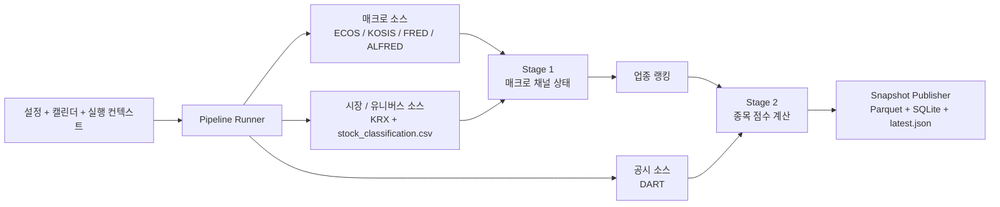
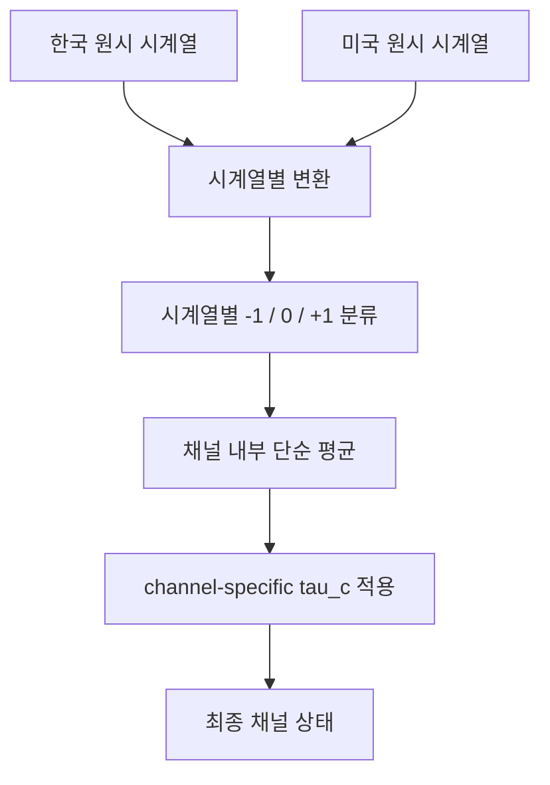
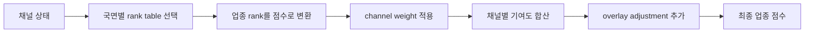
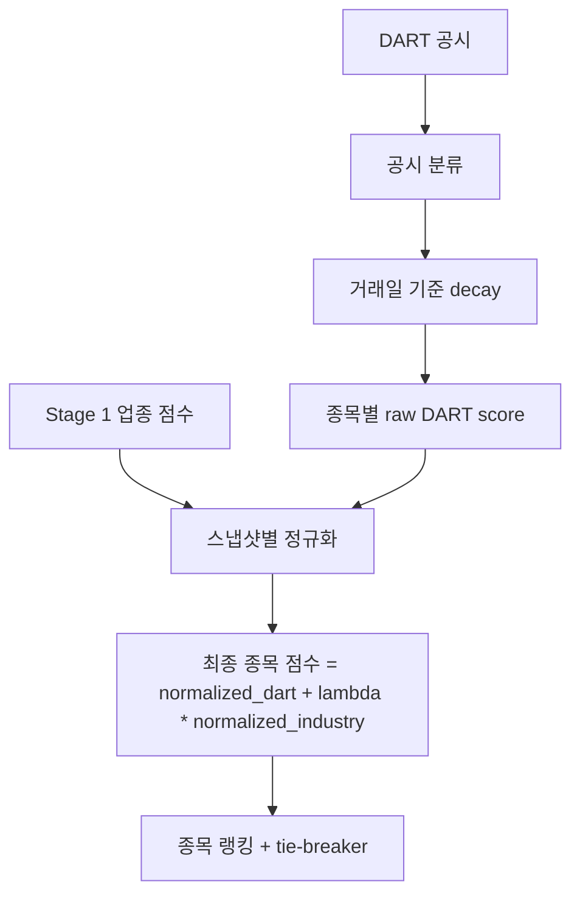
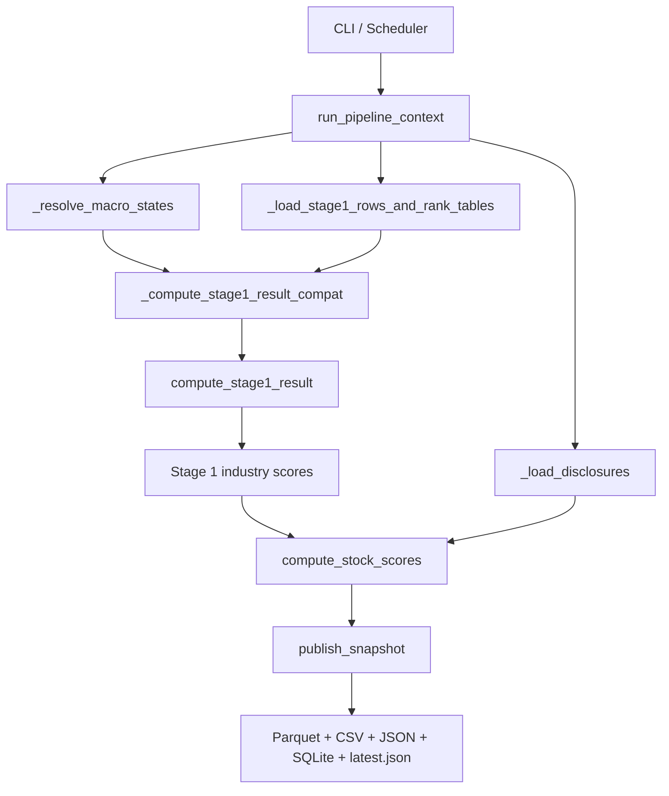
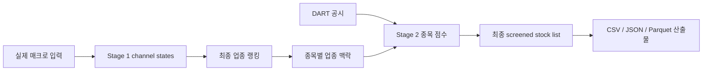

# Macro Screener MVP

[English version](README.md)

**매크로 국면 기반 2단계 한국 주식 스크리너**를 위한 최소 실행 가능 MVP입니다.

최종 사용자용 문서 세트는 다음과 같습니다.
- `doc/strategy.md`
- `doc/prd.md`
- `doc/plan.md`
- `doc/open-questions.md`

## 프로그램이 하는 일

이 저장소는 **배치형 한국 주식 스크리너**를 구현합니다.
새 사용자는 이 README를 통해 다음을 이해할 수 있어야 합니다.
- 프로그램이 어떤 데이터를 수집하는지
- 매크로 상태가 어떻게 업종 랭킹이 되는지
- 공시가 어떻게 종목 점수가 되는지
- 현재 코드가 어디까지 구현되어 있는지
- 무엇이 아직 의도적으로 provisional 상태인지

상위 수준 데이터 흐름은 다음과 같습니다.



이 시스템은 **포트폴리오 엔진이 아니라 스크리너**입니다.
즉,
- 업종을 랭킹하고,
- 그 위에서 종목을 랭킹하고,
- 변경 불가능한 스냅샷을 발행하지만,
- 최종 매수 종목 수나 비중을 결정하지는 않습니다.

### Stage 1 — 업종 랭킹

Stage 1은 한국/미국 매크로 입력을 5개 채널 상태로 만든 뒤, 그 채널 상태를 사용해 전체 업종 랭킹을 계산합니다.

#### 1) 매크로 채널

프로그램은 다음 5개 채널을 사용합니다.
- `G` — 성장 / 경기활동
- `IC` — 인플레이션 / 비용
- `FC` — 금융여건
- `ED` — 외부수요
- `FX` — 외환

부호 의미는 **변화율 언어가 아니라 상태 언어**입니다.

| 채널 | `+1` | `0` | `-1` |
|---|---|---|---|
| `G` | 추세 상회 경기활동 | 중립 | 추세 하회 경기활동 |
| `IC` | 높은 비용 압력 | 중립 | 낮은 비용 압력 |
| `FC` | 완화된 금융여건 | 중립 | 긴축된 금융여건 |
| `ED` | 우호적인 외부수요 | 중립 | 약한 외부수요 |
| `FX` | 원화 약세 / 수출주 우호 | 중립 | 원화 강세 / 수입주 우호 |

`0`은 **오직 중립**만 의미합니다. 결측/실패/폴백은 메타데이터와 경고 플래그로 표현됩니다.

#### 2) 각 채널이 어떤 데이터를 쓰는지

현재 ratified 설계는 **한국 + 미국 외부 매크로**만 사용합니다.

| 채널 | 한국 측 시계열 | 미국 측 시계열 | 주 제공자 | 현재 변환 방식 개요 |
|---|---|---|---|---|
| `G` | 한국 산업생산 YoY | 미국 산업생산 YoY | ECOS / FRED | 3개월 이동평균 YoY |
| `IC` | 한국 CPI YoY | 미국 CPI YoY | ECOS / FRED | 3개월 이동평균 + 목표대비 밴드 |
| `FC` | 한국 회사채 스프레드 | 미국 회사채 스프레드 | ECOS / FRED | 과거 대비 z-score |
| `ED` | 한국의 대미 수출 YoY | 미국 실질 재화수입 YoY | ECOS / FRED | 3개월 이동평균 YoY |
| `FX` | USD/KRW | 광의 달러지수 | ECOS / FRED | 3개월 log return |

`ED` 채널의 핵심 규칙:
- 기본 미국 `ED` 시계열 = **US real imports of goods YoY**
- fallback = **US real personal consumption expenditures on goods YoY**
- fallback은 **live degraded mode** 에서만 허용
- fallback 사용 시 confidence를 낮추고 명시적 metadata를 남김
- 공식 historical validation/backtest의 canonical series는 아님

#### 3) 매크로 채널이 만들어지는 방식

각 채널은 개념적으로 다음 순서로 만들어집니다.



현재 사용 중인 중립 밴드는 다음과 같습니다.

| 채널 | `tau_c` |
|---|---:|
| `G` | `0.25` |
| `IC` | `0.25` |
| `FC` | `0.25` |
| `ED` | `0.25` |
| `FX` | `0.50` |

`FX`는 변동성이 더 커서 더 보수적인 임계값을 사용합니다.

#### 4) Stage 1이 업종 순위와 점수를 계산하는 방식

현재 구현은 **provisional Stage 1 artifact**를 사용합니다.
- `config/stage1_sector_rank_tables.v1.json`
- 그리고 파생 taxonomy 파일 `data/reference/industry_master.csv`

이 artifact에는 다음이 들어 있습니다.
- 채널/국면별 업종 순서표
- channel weight
- neutral-band 기본값
- provisional bootstrap scoring 설정

점수 흐름은 다음과 같습니다.



쉽게 말하면,
1. 각 채널 상태에 따라 positive/negative rank table을 고르고,
2. 업종 순위를 정규화 점수로 바꾸고,
3. channel weight를 곱한 뒤,
4. 채널별 점수를 합산하고,
5. 마지막에 overlay adjustment를 더합니다.

현재 구현은 다음 두 경로를 모두 가집니다.
- runner가 artifact를 읽어 사용하는 **rank-table 기반 경로**
- 일부 구간에 남아 있는 구버전/manual fallback 경로

### Stage 2 — 종목 랭킹

Stage 2는 DART 스타일 공시 이벤트를 종목 점수로 바꾸고, Stage 1 업종 맥락과 결합합니다.

#### 1) Stage 2 입력

Stage 2는 다음을 사용합니다.
- KRX + `stock_classification.csv` 기반 종목 유니버스 및 업종 매핑
- DART 공시 이벤트
- Stage 1 업종 점수

#### 2) 공시 점수 계산 방식

각 공시는 블록 타입으로 분류되고, 거래일 기준으로 decay 됩니다.
예시 블록 타입:
- 공급계약
- 자기주식
- 시설투자
- 희석성 자금조달
- 정정 / 취소 / 철회
- 지배구조 리스크
- neutral / unknown

알 수 없는 공시 타입은 실패가 아니라 neutral 처리되고, unknown 비율이 운영상 모니터링됩니다.

#### 3) Stage 2가 종목 점수를 계산하는 방식



현재 로직은 다음과 같습니다.
1. 종목별로 보이는 공시를 모으고,
2. 블록 타입으로 분류하고,
3. half-life decay를 적용하고,
4. raw DART score를 합산하고,
5. raw DART score를 cross-section z-score로 정규화하고,
6. Stage 1 업종 점수도 정규화한 뒤,
7. 현재 `lambda` 가중치로 결합합니다.

현재 기본값:
- industry contribution weight (`lambda`) = `0.35`
- `FinancialScore = 0` 이지만, 슬롯은 모델에 유지됩니다.

#### 4) 어떤 provider가 무엇에 쓰이는가

| Provider | 현재 역할 | 현재 쓰는 데이터 | 런타임 상태 |
|---|---|---|---|
| `KRX` | 시장/유니버스 소스 | 승인된 마스터 다운로드 기반 보통주 유니버스 + 로컬 taxonomy join | active runtime provider |
| `DART` | 공시 소스 | Stage 2 공시 이벤트(유가증권+코스닥) | active runtime provider |
| `ECOS` | 한국 매크로/통계 소스 | 산업생산 / CPI / 신용스프레드 / 환율 / 국가별 수출입 시계열 | active runtime provider path |
| `KOSIS` | 한국 매크로/통계 소스 | KOSIS series identifier가 설정된 경우 Korea external-demand live path에 참여 | conditional runtime provider |
| `FRED` | 미국 매크로 소스 | 미국 산업생산 / CPI / 신용스프레드 / 재화수입 / broad USD | active runtime provider path |
| `ALFRED` | 미국 역사 버전 소스 | vintage-aware historical validation 예정 경로 | planned / partial runtime path |
| `BIS` | 참고 / 향후 확장 | 현재 런타임에서는 직접 수집하지 않음 | not an MVP runtime provider |
| `OECD` | 참고 / 향후 확장 | 현재 런타임에서는 직접 수집하지 않음 | not an MVP runtime provider |
| `IMF` | 참고 / backfill | 현재 MVP 런타임 경로에서는 직접 사용하지 않음 | not an MVP runtime provider |

즉 “현재 BIS/OECD/IMF에서 무엇을 수집하느냐?”에 대한 답은:
- **현재 MVP active runtime path에서는 없음**
- reference / future-extension / secondary-validation 용도만 남아 있습니다.

### 현재 DART 런타임 동작

현재 live DART 경로는 다음과 같이 동작합니다.
- disclosure API를 **페이지네이션** 하며 page 1만 보고 끝내지 않고,
- **당일 공시도 현재 run cutoff 시점에서 visible** 하게 처리하고,
- `accepted_at`, `input_cutoff`, `rcept_dt`, `rcept_no` 를 포함한 **구조화된 cursor** 를 저장하며,
- 예전 cutoff-only watermark 상태에서 과도한 과거 disclosure replay가 발생하지 않도록 제한합니다.

즉, 일반적인 `manual-run`은 이제:
- 과거 잘못된 DART watermark 상태에서도 회복 가능하고,
- partial parquet-only 출력이 아니라 complete snapshot 발행을 목표로 하며,
- run 시점에 실제로 visible 한 disclosure 창에 더 가깝게 DART cache를 유지합니다.

## 현재 구현 상태

코드베이스는 이제 단순 뼈대가 아닙니다. 현재 저장소 상태에는 다음이 포함됩니다.
- ratified strategy / PRD / implementation-plan 문서
- materialized provisional Stage 1 artifact 및 derived taxonomy 파일
- artifact-backed Stage 1 runner 경로
- ChannelState metadata 확장
- persisted fallback metadata round-trip
- DART cursor/store hardening
- 최신 runtime path를 검증하는 regression test

현재 production-like 한 부분:
- `manual`, `scheduled`, `demo`, `backtest` 실행 경로가 존재
- immutable snapshot 발행
- SQLite 운영/감사 저장소 존재
- runner가 `manual-run` / `scheduled-run` 모두에서 provisional Stage 1 artifact를 실제로 읽음
- `manual-run` / `scheduled-run` 이 동일한 live-provider 파이프라인으로 macro / disclosure / stock universe 를 읽음
- live macro 경로는 ECOS/FRED를 직접 사용하며, 설정이 있으면 Korea external-demand 데이터에 KOSIS를 우선 사용할 수 있음
- 승인된 KIS/KRX 마스터 다운로드 기반 live stock universe를 만든 뒤 로컬 taxonomy authority와 join 가능
- `DART_API_KEY`가 있으면 DART live 모드가 동작하고, stale-cache degraded 경로가 명시적으로 남음
- DART live ingestion은 이제 페이지네이션을 수행하고 `rcept_dt` / `rcept_no` 를 포함한 실제 cursor를 저장함
- 종목 row에 `block_scores={}` 같은 빈 nested field가 있어도 snapshot 산출물을 끝까지 발행할 수 있음

아직 의도적으로 provisional 인 부분:
- Stage 1 artifact는 **provisional** 이며, 최종 review된 research artifact는 아님
- KOSIS runtime 참여는 Korea external-demand series identifier가 설정된 경우에 활성화되며, 없으면 명시적으로 fallback 됨
- ALFRED/vintage retrieval은 아직 primary historical runtime path가 아님
- 명시적 manual/fallback 매크로 경로는 diagnostics / degraded 실행용으로 남아 있지만, ordinary `manual-run`의 기본 동작은 아님
- 실환경 provider credential/connectivity는 README만으로 보장되지 않음

## 현재 코드의 데이터 경계

코드를 기준으로 읽을 때 중요한 모듈은 다음과 같습니다.

| 모듈 | 역할 |
|---|---|
| `src/macro_screener/pipeline/runner.py` | 매크로 상태, Stage 1, Stage 2, publishing까지 총괄하는 메인 런타임 |
| `src/macro_screener/data/macro_client.py` | live macro 소스 추상화, optional KOSIS 참여, explicit fallback reload |
| `src/macro_screener/data/reference.py` | derived industry master 및 provisional Stage 1 artifact 생성 |
| `src/macro_screener/data/krx_client.py` | 종목 유니버스, KRX 시장 맥락, stock-to-industry 매핑 |
| `src/macro_screener/data/dart_client.py` | DART 공시 수집과 cursor/watermark 처리 |
| `src/macro_screener/stage1/ranking.py` | Stage 1 점수 계산과 업종 랭킹 |
| `src/macro_screener/stage1/channel_state.py` | runtime metadata를 `ChannelState` record로 변환 |
| `src/macro_screener/stage2/ranking.py` | Stage 2 종목 점수/랭킹 계산 |
| `src/macro_screener/db/store.py` | snapshot store, watermark, channel-state snapshot 저장 |
| `src/macro_screener/backtest/engine.py` | replay/backtest 실행 |

코드 기준 함수/모듈 데이터 흐름은 다음과 같습니다.



## 실행 방법

실제 production 스타일 실행을 하려면, 저장소 루트 `.env`에 provider key를 넣으면 됩니다.
현재 런타임은 `.env`를 자동으로 읽습니다.

현재 의미 있는 키:
- `DART_API_KEY`
- `ECOS_API_KEY`
- `FRED_API_KEY`
- `KOSIS_API_KEY`
- 이후 API-key 기반 KRX fetch를 쓸 경우 `KRX_API_KEY`

대표 실행 예시는 다음과 같습니다.

### 1) 수동 실행

```bash
./.venv/Scripts/python.exe -m macro_screener manual-run
```

`manual-run`은 이제 standard live-provider 파이프라인을 **수동으로 트리거**하는 명령입니다. 명시적으로 manual baseline 경로를 고르지 않는 한, `scheduled-run`과 같은 live data 경로를 사용합니다.

현재 기본 동작의 중요한 점:
- **repo root에서 실행**
- 기본 output root는 `src`
- 따라서 snapshot은 `src/data/snapshots/...` 아래에 생성
- top-level `macro_screener/` 패키지가 있어서 `src` 안으로 들어가지 않고 실행 가능

### 2) 스케줄 방식 실행

```bash
./.venv/Scripts/python.exe -m macro_screener scheduled-run \
  --trading-date 2026-03-23 \
  --run-type pre_open
```

`scheduled-run`은 그 동일한 live-provider 파이프라인을 **스케줄로 트리거**하는 명령입니다. 같은 입력 시점을 맞추면 `manual-run`과 `scheduled-run`은 같은 provider 데이터를 소비하고 같은 구조의 결과를 발행하는 것이 목표입니다.

### 3) 백테스트 / 리플레이

```bash
./.venv/Scripts/python.exe -m macro_screener backtest-run \
  --start-date 2026-03-20 \
  --end-date 2026-03-23
```

ordinary live-provider path 대신 explicit zero-baseline/fallback 경로가 필요하면 다음처럼 실행할 수 있습니다.

```bash
./.venv/Scripts/python.exe -m macro_screener manual-run \
  --macro-source manual
```

실제 적용되는 runtime config를 확인하려면:

```bash
./.venv/Scripts/python.exe -m macro_screener show-config
```

엄격한 live-provider 동작을 원하면 다음 설정을 사용하면 됩니다.

```yaml
environment: "production"
runtime:
  normal_mode: "live"
```

이 모드에서는:
- `manual-run`과 `scheduled-run`이 모두 기본적으로 live-provider 경로를 사용하고,
- manual macro default를 정상 기본 경로로 허용하지 않고,
- non-live KRX source를 거부하며,
- demo/file DART fallback으로 fake success가 나는 것을 막습니다.

## 이 프로그램이 최종 결과를 만드는 방식

이 프로그램의 최종 운영상 목표는 **최종 screened stock list** 입니다.

런타임은 다음 순서로 결과를 만듭니다.
1. 매크로 입력 fetch / resolve
2. 5개 macro channel 상태 계산
3. Stage 1에서 전체 업종 랭킹 계산
4. DART + Stage 1 맥락을 결합해 Stage 2 종목 점수 계산
5. 기계친화적 산출물과 운영자 친화적 산출물을 함께 발행

개념 흐름:



### 가장 중요한 결과 뷰 2개

#### 1) 최종 업종 랭킹
Stage 1의 최종 업종 순위표입니다.

사용 파일:
- `industry_scores.csv`
- `industry_scores.parquet`

#### 2) 최종 screened stock list
이게 가장 중요한 최종 결과입니다.
Stage 2가 계산한 최종 종목 랭킹입니다.

사용 파일:
- `screened_stock_list.csv` ← 운영자 입장에서 가장 보기 쉬운 파일
- `screened_stocks_by_score.json` ← 종목 최종 점수 순 flat view
- `stock_scores.parquet`

업종별로 종목이 어떻게 묶였는지 보고 싶다면:
- `screened_stocks_by_industry.json`

이 JSON은 업종 순위별로 종목 리스트를 묶어서,
- 어떤 업종이 상위였는지,
- 각 업종 안에서 어떤 종목이 최종 선별되었는지,
- 최종 stock list가 업종별로 어떻게 분포하는지
를 바로 볼 수 있게 해줍니다.

## 발행 계약

정식 downstream MVP 발행 계약은 다음과 같습니다.
- immutable parquet 산출물
- 최신 포인터 파일 `data/snapshots/latest.json`
- SQLite 운영/감사 저장소 (주요 외부 소비 인터페이스는 아님)

하나의 published run은 보통 다음을 씁니다.
- industry parquet
- stock parquet
- industry CSV
- final screened stock CSV
- 종목 점수 순 screened stocks JSON
- 업종별 screened stocks JSON
- snapshot JSON
- latest pointer JSON
- snapshots / published windows / watermarks / channel-state snapshots 를 위한 SQLite 레코드

현재 검증된 runtime 기준으로 성공한 `manual-run`은 다음을 생성합니다.
- `industry_scores.csv`
- `industry_scores.parquet`
- `screened_stock_list.csv`
- `screened_stocks_by_score.json`
- `screened_stocks_by_industry.json`
- `snapshot.json`
- `stock_scores.parquet`
- `src/data/snapshots/latest.json`

상태 의미:
- `published` = 정상 발행
- `incomplete` = Stage 1은 성공했지만 Stage 2 실패 또는 Stage-1-only fallback 발행
- `duplicate` = 동일 scheduled window가 이미 발행되어 overwrite 대신 skip

## 참고

- 이 저장소는 **배치형 스크리너**이며 포트폴리오 구성/집행 엔진이 아닙니다.
- 현재 런타임 경로는 **한국 + 미국 외부 매크로**만 사용합니다.
- `BIS`, `OECD`, `IMF` 는 현재 **MVP runtime provider가 아니라 참고/향후 확장용 provider** 입니다.
- Stage 1 artifact는 의도적으로 provisional 이며, 이후 review된 versioned artifact로 교체하는 것이 바람직합니다.
- README와 코드 주석이 충돌할 때는 `doc/strategy.md`, `doc/prd.md`, `doc/plan.md`를 최종 권한 문서로 보아야 합니다.
