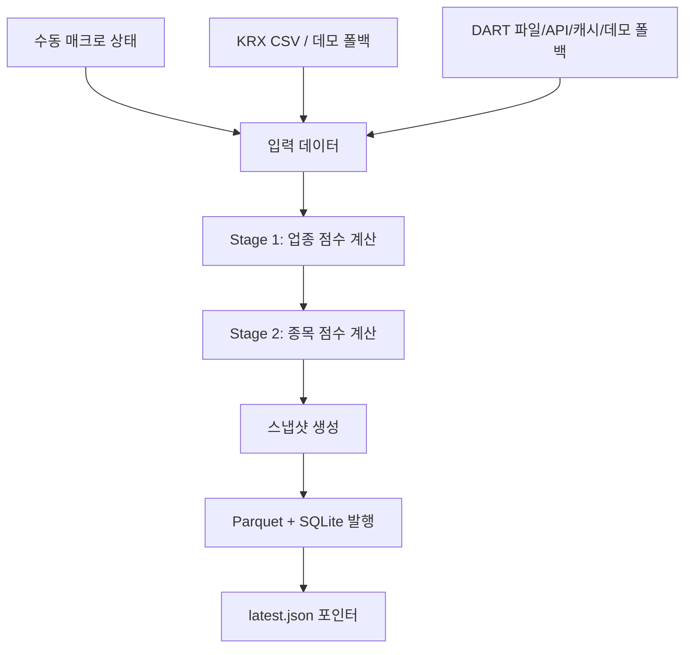
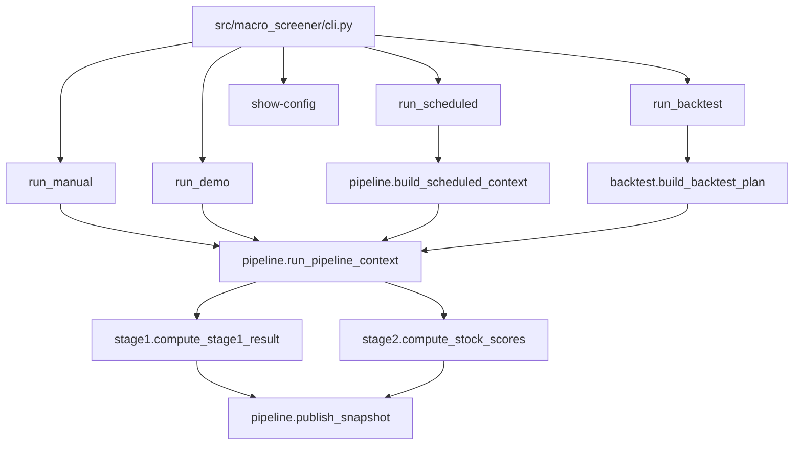
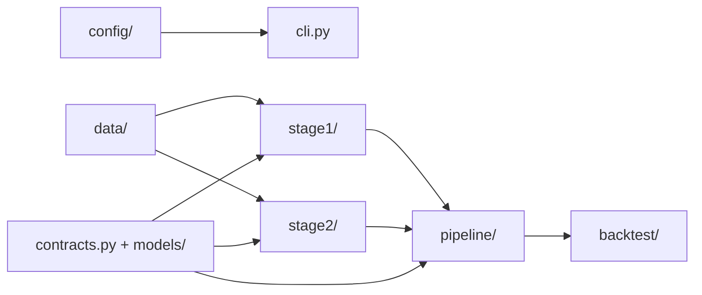

# Macro Screener MVP

[English version](README.md)

**매크로 국면 기반 2단계 한국 주식 스크리너**를 위한 최소 실행 가능 MVP입니다.

이 프로그램은 다음 문서를 기준으로 동작합니다.
- `doc/strategy.md`
- `doc/prd.md`
- `doc/plan.md`

현재 구현은 로컬에서 재현 가능한 MVP로서 다음을 수행합니다.
- 매크로 채널 상태를 바탕으로 **업종 점수**를 계산합니다.
- DART 스타일 공시 이벤트와 업종 맥락을 바탕으로 **종목 점수**를 계산합니다.
- **parquet + SQLite** 형식으로 변경 불가능한 스냅샷을 발행합니다.
- **manual**, **demo**, **scheduled**, **backtest** 실행 경로를 지원합니다.

> 중요: 이 프로젝트는 아직 MVP 단계입니다.
> 현재는 실제 런타임 경계와 영속성은 갖추었지만, 일부 데이터 소스는 여전히 수동 입력, 파일 기반 입력, 캐시, 또는 데모 폴백에 의존합니다.

## 핵심 문서

### 한국어
- `README.ko.md`
- `doc/strategy.ko.md`
- `doc/prd.ko.md`
- `doc/plan.ko.md`

### English
- `README.md`
- `doc/strategy.md`
- `doc/prd.md`
- `doc/plan.md`

---

## 1. 이 프로그램이 하는 일

이 스크리너는 두 단계로 동작합니다.

### Stage 1 — 업종 랭킹
5개의 매크로 채널 상태를 업종 점수로 변환합니다.

채널:
- `G` — 성장 / 경기활동
- `IC` — 인플레이션 / 비용
- `FC` — 금융여건
- `ED` — 외부수요
- `FX` — 외환

MVP에서는 채널 상태를 **수동/스텁 입력**으로 받습니다.

### Stage 2 — 종목 랭킹
DART 스타일 공시 이벤트를 종목 점수로 변환하고, 여기에 Stage 1 업종 점수를 결합합니다.

결과물:
- 전체 업종 랭킹
- 전체 종목 랭킹
- 발행된 스냅샷 산출물

MVP에는 **하드 컷오프가 없습니다.** 결과는 매수 종목 리스트가 아니라 전체 순위표입니다.

---

## 2. 프로그램이 데이터를 가져오는 방식

현재 MVP의 데이터 소스는 실제 패키지 경계 뒤에 배치되어 있으며,
설정 상태에 따라 수동 / 파일 / 라이브 시도 / 폴백 방식으로 동작합니다.

### 현재 구현된 데이터 경로
- `src/macro_screener/data/macro_client.py`
  - 문서상 MVP 기준 소스로 **수동 채널 상태**를 사용합니다.
  - **마지막으로 저장된 채널 상태(last-known)** 폴백을 지원합니다.
- `src/macro_screener/data/krx_client.py`
  - `KRXClient`
  - `stock_classification.csv`가 있으면 읽습니다.
  - `data/industry_exposures.json`이 있으면 읽습니다.
  - 입력이 없으면 내장된 데모 종목군/노출도 세트로 폴백합니다.
- `src/macro_screener/data/dart_client.py`
  - `DARTClient`
  - 로컬 공시 파일이 있으면 읽습니다.
  - `DART_API_KEY`가 설정되어 있으면 DART OpenAPI 목록 조회를 시도할 수 있습니다.
  - 마지막 성공 공시 payload를 캐시에 저장해 stale fallback에 사용합니다.
  - 아무 것도 설정되지 않으면 데모 공시로 폴백합니다.

### 아직 보류(deferred)된 항목
문서 기준으로 다음 항목은 여전히 의도적으로 보류 상태입니다.
- KRX 공식 시세/종목 엔드포인트 연동
- 확정된 프로덕션용 매크로 공식 / 임계값 / 소스 매핑
- 한국 관련 매크로 소스: `ECOS`, `KOSIS`, 필요 시 `DART` 파생 입력
- 글로벌 매크로 소스: `BIS`
- 파일 이외의 공개 downstream 서비스/API 계약

즉, 현재 프로그램은 다음처럼 이해하면 됩니다.
- **실제 패키지 구조**
- **실제 랭킹 로직**
- **실제 런타임/영속성 흐름**
- **파일/라이브-폴백 어댑터 경계**
- **실제 스냅샷 발행 동작**

---

## 3. 랭킹 계산 방식

## 3.1 Stage 1 공식

업종 점수 계산은 주로 다음 파일에 구현되어 있습니다.
- `src/macro_screener/stage1/base_score.py`
- `src/macro_screener/stage1/overlay.py`
- `src/macro_screener/stage1/ranking.py`

### 기본 점수
각 업종에 대해:

```text
BaseScore = sum(exposure[channel] * channel_state[channel])
```

여기서:
- `exposure[channel]` 값은 `{-1, 0, +1}`
- `channel_state[channel]` 값도 `{-1, 0, +1}`

### 최종 업종 점수

```text
IndustryScore = BaseScore + OverlayAdjustment
```

### Stage 1 동점 처리 규칙
두 업종의 최종 점수가 같으면 다음 순서로 정렬합니다.
1. 절대 음수 패널티가 더 작은 업종
2. 양의 기여도가 더 큰 업종
3. 업종 코드 오름차순

---

## 3.2 Stage 2 공식

종목 점수 계산은 주로 다음 파일에 구현되어 있습니다.
- `src/macro_screener/stage2/classifier.py`
- `src/macro_screener/stage2/decay.py`
- `src/macro_screener/stage2/normalize.py`
- `src/macro_screener/stage2/ranking.py`

### 분류
공시는 다음과 같은 블록으로 매핑됩니다.
- `supply_contract`
- `treasury_stock`
- `facility_investment`
- `dilutive_financing`
- `correction_cancellation_withdrawal`
- `governance_risk`
- `neutral`

분류 순서:
- 먼저 event code를 사용
- 그다음 title 패턴 매칭을 폴백으로 사용

### 감쇠(Decay)
각 공시 이벤트는 감쇠된 점수 기여값으로 반영됩니다.

```text
DecayedContribution = BlockWeight * exp(-ln(2) * elapsed_days / half_life)
```

### 정규화
프로그램은 다음 값들에 대해 횡단면 z-score를 계산합니다.
- raw DART score
- raw industry score

분산이 0이면 z-score는 `0.0`이 됩니다.

### 최종 종목 점수

```text
FinalScore = z_dart + lambda * z_industry
```

현재 MVP의 lambda 값:
- `0.35`

### Stage 2 동점 처리 규칙
두 종목의 최종 점수가 같으면 다음 순서로 정렬합니다.
1. raw DART score가 더 높은 종목
2. raw industry score가 더 높은 종목
3. 종목 코드 오름차순

---

## 4. 스크리닝의 전체 흐름

### 상위 수준 흐름



### 함수 흐름



### 패키지 구조



### 실무적으로 보면
- `data/` 는 입력 경계를 제공합니다.
- `stage1/` 은 매크로 상태를 업종 순위로 바꿉니다.
- `stage2/` 는 공시를 종목 순위로 바꿉니다.
- `pipeline/` 은 스냅샷을 만들고 발행합니다.
- `backtest/` 는 같은 아이디어를 과거 거래일에 재생합니다.

---

## 5. 현재 코드 구조

```text
src/macro_screener/
├── cli.py                  # CLI 진입점
├── contracts.py            # 런타임 호환용 계약 shim
├── models/                 # 정식 계약 모델
├── config/                 # typed 설정 로딩
├── data/                   # KRX / DART / macro 경계
├── stage1/                 # 업종 점수 계산
├── stage2/                 # 종목 점수 계산
├── pipeline/               # runner / scheduler / publisher
├── backtest/               # 리플레이 헬퍼
└── mvp.py                  # MVP 흐름용 편의 export/glue
```

### 먼저 읽어볼 핵심 파일
- `src/macro_screener/cli.py`
- `src/macro_screener/pipeline/runner.py`
- `src/macro_screener/stage1/ranking.py`
- `src/macro_screener/stage2/ranking.py`
- `src/macro_screener/pipeline/publisher.py`

---

## 6. 출력물

프로그램은 지정한 output directory 아래에 스냅샷 산출물을 발행합니다.

예상 파일:
- `data/snapshots/<run_id>/industry_scores.parquet`
- `data/snapshots/<run_id>/stock_scores.parquet`
- `data/snapshots/<run_id>/snapshot.json`
- `data/snapshots/latest.json`
- `data/macro_screener.sqlite3`

### 각 출력물의 의미
- parquet 파일 = 표준 reader-facing 스냅샷 산출물
- `snapshot.json` = 사람이 읽기 쉬운 구조화 스냅샷
- `latest.json` = 최신 발행 스냅샷을 가리키는 포인터
- SQLite = 운영 / 감사용 저장소

---

## 7. 실행 방법

## 7.1 설치

프로젝트 루트에서:

```bash
pip install -e .[dev]
```

editable install 없이 소스에서 바로 실행하려면:

```bash
PYTHONPATH=src python3 -m macro_screener.cli show-config
```

## 7.2 현재 적용되는 설정 확인

```bash
PYTHONPATH=src python3 -m macro_screener.cli show-config
```

커스텀 설정 파일 사용:

```bash
PYTHONPATH=src python3 -m macro_screener.cli show-config --config config/default.yaml
```

## 7.3 실제 manual flow 실행

```bash
PYTHONPATH=src python3 -m macro_screener.cli manual-run \
  --output-dir ./tmp/manual \
  --run-id manual-run-001 \
  --channel-state G=1 \
  --channel-state ED=1
```

이 명령이 하는 일:
- 일반 파이프라인 / 런타임 경로를 사용합니다.
- 수동 매크로 상태를 사용합니다.
- KRX / DART 어댑터를 파일 / 캐시 / 데모 폴백과 함께 사용합니다.
- 불변 스냅샷을 기록하고 `latest.json` 을 업데이트합니다.

## 7.4 데모 wrapper 실행

```bash
PYTHONPATH=src python3 -m macro_screener.cli demo-run \
  --output-dir ./tmp/demo \
  --run-id demo-run-001
```

이 명령이 하는 일:
- 데모 KRX + 데모 DART + 수동/스텁 매크로 상태를 사용합니다.
- 업종 및 종목 순위를 계산합니다.
- 스냅샷 산출물을 기록합니다.

## 7.5 scheduled batch 실행

```bash
PYTHONPATH=src python3 -m macro_screener.cli scheduled-run \
  --output-dir ./tmp/scheduled \
  --trading-date 2026-03-23 \
  --run-type pre_open
```

## 7.6 backtest 실행

```bash
PYTHONPATH=src python3 -m macro_screener.cli backtest-run \
  --output-dir ./tmp/backtest \
  --start-date 2026-03-20 \
  --end-date 2026-03-23
```

---

## 8. 로컬 검증 방법

### Lint

```bash
ruff check src tests
```

### 테스트

```bash
PYTHONPATH=src python3 -m pytest -q tests
```

### Collection smoke

```bash
PYTHONPATH=src python3 -m pytest --collect-only -q tests
```

### Compile smoke

```bash
PYTHONPATH=src python3 -m compileall src tests
```

---

## 9. 현재 MVP의 한계

이 구현은 의도적으로 제한된 MVP입니다.

### 현재 한계
- KRX 공식 엔드포인트 연동은 아직 보류 상태입니다.
- 매크로 정책은 여전히 manual-first이며, 프로덕션 공식/임계값은 확정되지 않았습니다.
- DART 라이브 수집은 best-effort 수준이며, 로컬 개발에서는 fallback/cache 동작에 의존합니다.
- SQLite는 하나로 통합되었지만, 추가적인 물리 스키마 튜닝과 마이그레이션은 최소 수준으로만 유지합니다.

### 이미 실제로 구현된 것
- 패키지 / 모듈 구조
- 랭킹 로직
- 정식 계약 계층(`models/contracts.py`) + 호환 shim
- 스냅샷 발행 흐름
- latest snapshot 포인터
- scheduled-window 식별자
- 중복 scheduled-window 보호
- PIT를 고려한 backtest 흐름
- 로컬에서 재현 가능한 deterministic 검증

---

## 10. 권장 읽기 순서

1. `README.md`
2. `doc/strategy.md`
3. `doc/prd.md`
4. `doc/plan.md`
