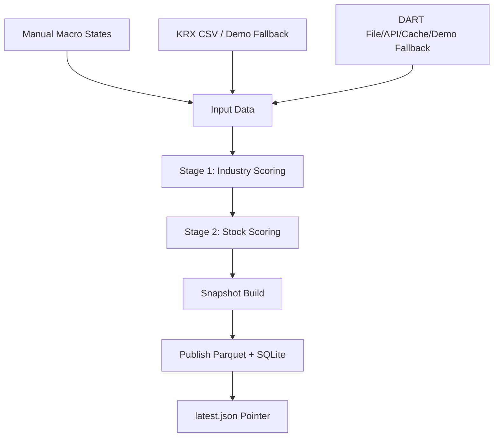
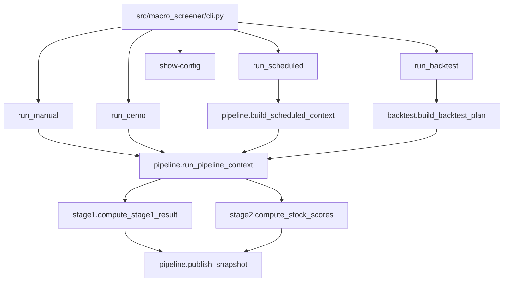
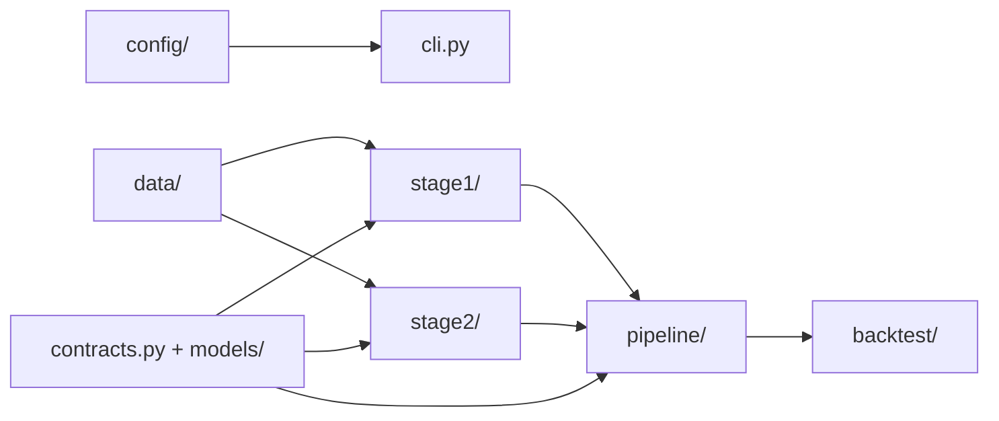

# Macro Screener MVP

A minimal, runnable MVP for a **macro regime-based two-stage Korean equity screener**.

The program reads the strategy and product rules from:
- `doc/strategy.md`
- `doc/prd.md`
- `doc/plan.md`

and implements a deterministic local MVP that:
- scores **industries** from macro channel states,
- scores **stocks** from DART-style disclosure events plus industry context,
- publishes immutable snapshots to **parquet + SQLite**,
- and supports **manual**, **demo**, **scheduled**, and **backtest** runs.

> Important: this is still an MVP.
> It now has real runtime seams and persistence, but several data sources still
> rely on manual, file-backed, cached, or demo fallbacks.

---

## 1. What this program does

The screener has two stages.

### Stage 1 — Industry ranking
It converts 5 macro channel states into industry scores.

Channels:
- `G` — Growth / Activity
- `IC` — Inflation / Cost
- `FC` — Financial Conditions
- `ED` — External Demand
- `FX` — Foreign Exchange

For the MVP, channel states come from **manual/stub input**.

### Stage 2 — Stock ranking
It converts DART-style disclosure events into stock scores and combines them with Stage 1 industry scores.

The result is:
- full industry ranking
- full stock ranking
- published snapshot artifacts

There is **no hard cutoff** in the MVP. The output is a full ranking, not a final trading list.

---

## 2. How the program gets data

Current MVP data sources are exposed behind real package boundaries, with
manual/file/live-fallback behavior depending on what is configured.

### Current implemented data path
- `src/macro_screener/data/macro_client.py`
  - uses **manual channel states** as the documented MVP source
  - supports **last-known persisted channel-state fallback**
- `src/macro_screener/data/krx_client.py`
  - `KRXClient`
  - reads `stock_classification.csv` if available
  - reads `data/industry_exposures.json` if available
  - falls back to the built-in demo universe/exposure set when inputs are missing
- `src/macro_screener/data/dart_client.py`
  - `DARTClient`
  - reads local disclosure files if available
  - can attempt DART OpenAPI list ingestion when `DART_API_KEY` is set
  - caches the last successful disclosure payload for stale fallback
  - falls back to demo disclosures when nothing else is configured

### What is deferred
The docs still intentionally defer:
- KRX official market-data endpoint integration
- frozen production macro formulas / thresholds / source mapping
- Korea-related macro sources: `ECOS`, `KOSIS`, `DART`-derived inputs where relevant
- global macro source: `BIS`
- any public downstream service/API contract beyond files

So the current program is best understood as:
- **real package structure**
- **real ranking logic**
- **real runtime/persistence flow**
- **file/live-fallback adapter seams**
- **real publication behavior**

---

## 3. How ranking is calculated

## 3.1 Stage 1 formula

Industry scoring is implemented mainly through:
- `src/macro_screener/stage1/base_score.py`
- `src/macro_screener/stage1/overlay.py`
- `src/macro_screener/stage1/ranking.py`

### Base score
For each industry:

```text
BaseScore = sum(exposure[channel] * channel_state[channel])
```

Where:
- `exposure[channel]` is in `{-1, 0, +1}`
- `channel_state[channel]` is in `{-1, 0, +1}`

### Final industry score

```text
IndustryScore = BaseScore + OverlayAdjustment
```

### Stage 1 tie-breakers
If two industries have the same final score, sort by:
1. lower absolute negative penalty
2. higher positive contribution
3. industry code ascending

---

## 3.2 Stage 2 formula

Stock scoring is implemented mainly through:
- `src/macro_screener/stage2/classifier.py`
- `src/macro_screener/stage2/decay.py`
- `src/macro_screener/stage2/normalize.py`
- `src/macro_screener/stage2/ranking.py`

### Classification
Disclosures are mapped to blocks such as:
- `supply_contract`
- `treasury_stock`
- `facility_investment`
- `dilutive_financing`
- `correction_cancellation_withdrawal`
- `governance_risk`
- `neutral`

Classification uses:
- event code first
- title pattern fallback second

### Decay
Each classified event contributes a decayed score:

```text
DecayedContribution = BlockWeight * exp(-ln(2) * elapsed_days / half_life)
```

### Normalization
The program computes cross-sectional z-scores for:
- raw DART score
- raw industry score

If variance is zero, z-score becomes `0.0`.

### Final stock score

```text
FinalScore = z_dart + lambda * z_industry
```

Current MVP lambda:
- `0.35`

### Stage 2 tie-breakers
If two stocks have the same final score, sort by:
1. higher raw DART score
2. higher raw industry score
3. stock code ascending

---

## 4. How screening works end-to-end

### High-level flow



### Function flow



### Package structure



### Practical meaning
- `data/` provides input boundaries
- `stage1/` turns macro state into industry ranks
- `stage2/` turns disclosures into stock ranks
- `pipeline/` creates/publishes snapshots
- `backtest/` replays the same ideas across trading days

---

## 5. Current code structure

```text
src/macro_screener/
├── cli.py                  # CLI entrypoints
├── contracts.py            # simple runtime-facing contracts
├── models/                 # richer contract models
├── config/                 # typed config loading
├── data/                   # KRX / DART / macro boundaries
├── stage1/                 # industry scoring
├── stage2/                 # stock scoring
├── pipeline/               # runner / scheduler / publisher
├── backtest/               # replay helpers
└── mvp.py                  # convenience exports/glue for the MVP flow
```

### Key files to read first
- `src/macro_screener/cli.py`
- `src/macro_screener/pipeline/runner.py`
- `src/macro_screener/stage1/ranking.py`
- `src/macro_screener/stage2/ranking.py`
- `src/macro_screener/pipeline/publisher.py`

---

## 6. Outputs

The program publishes snapshot artifacts under the output directory you pass.

Expected files:
- `data/snapshots/<run_id>/industry_scores.parquet`
- `data/snapshots/<run_id>/stock_scores.parquet`
- `data/snapshots/<run_id>/snapshot.json`
- `data/snapshots/latest.json`
- `data/macro_screener.sqlite3`

### Meaning of outputs
- parquet files = canonical reader-facing snapshot artifacts
- `snapshot.json` = readable structured snapshot
- `latest.json` = pointer to the latest published snapshot
- SQLite = operational/audit store

---

## 7. How to run

## 7.1 Install

From the project root:

```bash
pip install -e .[dev]
```

If you only want to run from source without editable install:

```bash
PYTHONPATH=src python3 -m macro_screener.cli show-config
```

## 7.2 Show effective config

```bash
PYTHONPATH=src python3 -m macro_screener.cli show-config
```

Use a custom config file:

```bash
PYTHONPATH=src python3 -m macro_screener.cli show-config --config config/default.yaml
```

## 7.3 Run the real manual flow

```bash
PYTHONPATH=src python3 -m macro_screener.cli manual-run \
  --output-dir ./tmp/manual \
  --run-id manual-run-001 \
  --channel-state G=1 \
  --channel-state ED=1
```

What it does:
- uses the normal pipeline/runtime path
- uses manual macro states
- uses KRX/DART adapters with file/cache/demo fallback behavior
- writes immutable snapshot artifacts and updates `latest.json`

## 7.4 Run the demo wrapper

```bash
PYTHONPATH=src python3 -m macro_screener.cli demo-run \
  --output-dir ./tmp/demo \
  --run-id demo-run-001
```

What it does:
- uses demo KRX + demo DART + manual/stub macro states
- computes industry and stock ranks
- writes snapshot artifacts

## 7.5 Run a scheduled batch

```bash
PYTHONPATH=src python3 -m macro_screener.cli scheduled-run \
  --output-dir ./tmp/scheduled \
  --trading-date 2026-03-23 \
  --run-type pre_open
```

## 7.6 Run a backtest

```bash
PYTHONPATH=src python3 -m macro_screener.cli backtest-run \
  --output-dir ./tmp/backtest \
  --start-date 2026-03-20 \
  --end-date 2026-03-23
```

---

## 8. How to verify locally

### Lint

```bash
ruff check src tests
```

### Tests

```bash
PYTHONPATH=src python3 -m pytest -q tests
```

### Collection smoke

```bash
PYTHONPATH=src python3 -m pytest --collect-only -q tests
```

### Compile smoke

```bash
PYTHONPATH=src python3 -m compileall src tests
```

---

## 9. Limitations of the current MVP

This implementation is intentionally limited.

### Current limitations
- KRX official endpoint integration is still deferred
- macro policy is still manual-first; production formulas/thresholds are not frozen
- DART live ingestion is best-effort and still relies on fallback/cache behavior in local development
- SQLite is now unified, but further physical tuning and migrations remain minimal by design

### What is already real
- package/module layout
- ranking logic
- one canonical contract layer (`models/contracts.py`) with a compatibility shim
- publication flow
- latest snapshot pointer
- scheduled-window identity
- duplicate scheduled-window protection
- PIT-aware backtest flow
- local deterministic verification

---

## 10. Recommended reading order

1. `README.md`
2. `doc/strategy.md`
3. `doc/prd.md`
4. `doc/plan.md`
