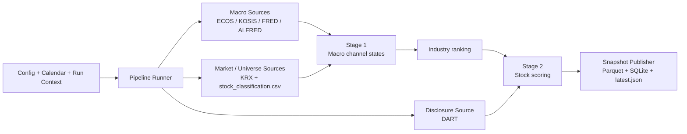
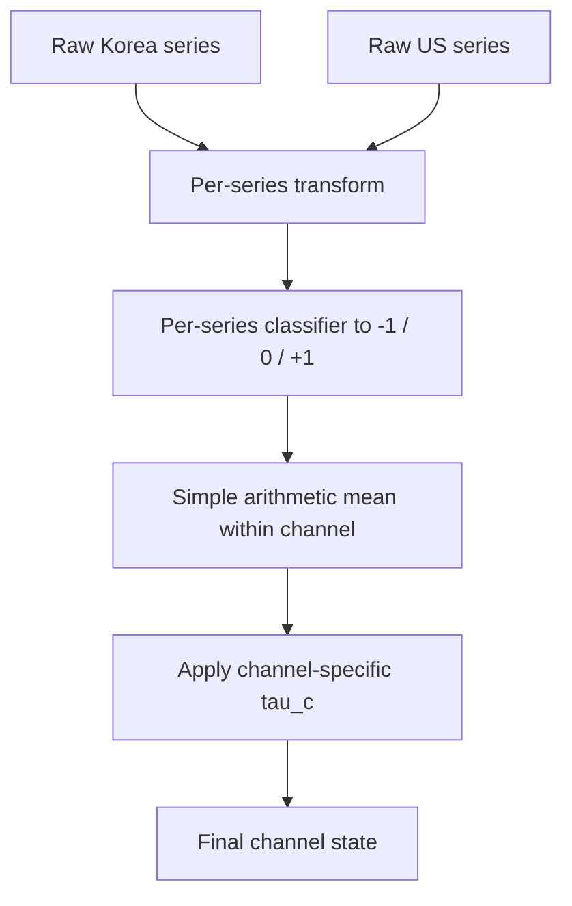
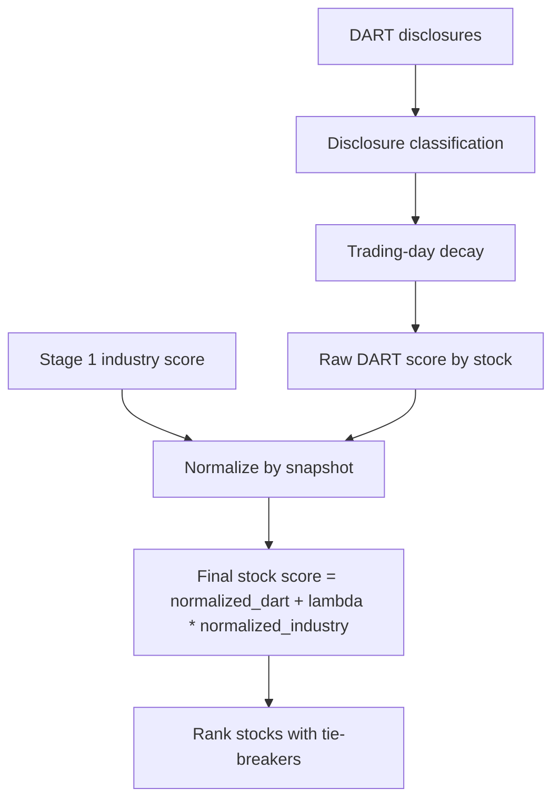
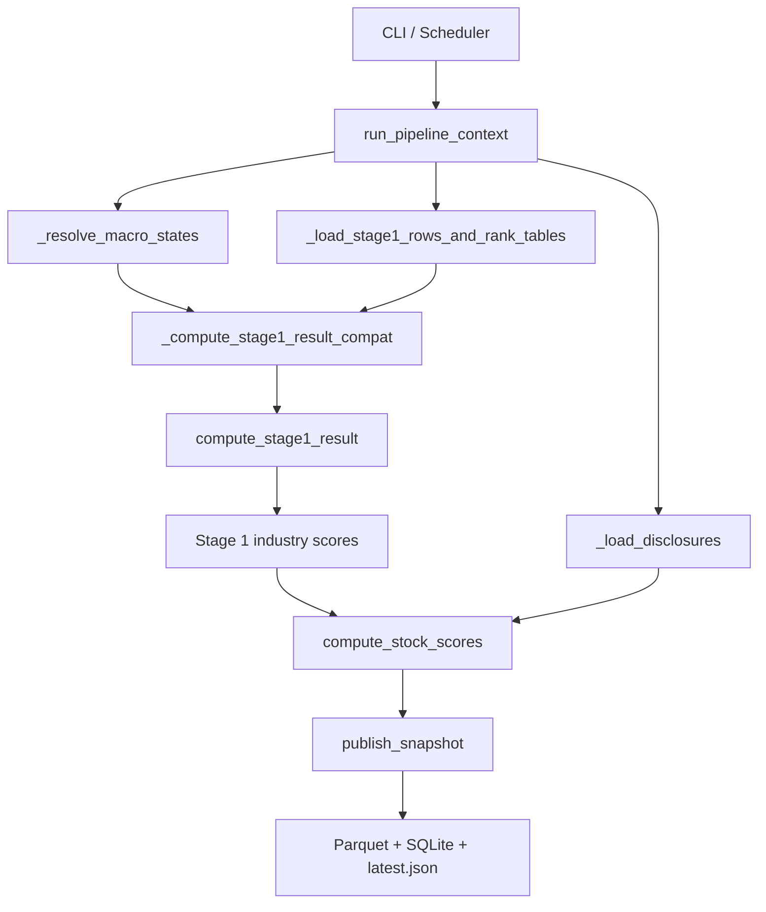

# Macro Screener MVP

[한국어 버전](README.ko.md)

A minimal, runnable MVP for a **macro regime-based two-stage Korean equity screener**.

The final human-facing doc set is:
- `doc/strategy.md`
- `doc/prd.md`
- `doc/plan.md`
- `doc/open-questions.md`

## What the program does

This repository implements a **batch screener** for Korean equities.
It is designed to help a new user understand:
- what data the program collects,
- how macro state becomes an industry ranking,
- how disclosures become a stock ranking,
- what is already implemented in code,
- and what is still intentionally provisional.

At a high level, the runtime works like this:

This is a **full-universe ranking system**, not a portfolio engine:
- it ranks industries,
- then ranks stocks,
- and publishes immutable snapshots,
- without deciding how many names to buy or how to size them.

### Stage 1 — Industry ranking

Stage 1 converts macro inputs into five channel states, then converts those channel states into a ranked industry table.

#### 1) Macro channels

The program uses five macro channels:
- `G` — Growth / Activity
- `IC` — Inflation / Cost
- `FC` — Financial Conditions
- `ED` — External Demand
- `FX` — Foreign Exchange

The sign semantics are **state-language semantics**, not acceleration-language semantics:

| Channel | `+1` | `0` | `-1` |
|---|---|---|---|
| `G` | above-trend activity | neutral | below-trend activity |
| `IC` | elevated cost pressure | neutral | subdued cost pressure |
| `FC` | easy financial conditions | neutral | tight financial conditions |
| `ED` | supportive external demand | neutral | weak external demand |
| `FX` | KRW-weak / exporter-favorable currency state | neutral | KRW-strong / importer-favorable currency state |

`0` means **neutral only**. Missing or stale inputs are tracked through metadata and fallback flags, not silently encoded as neutral.

#### 2) Which data each macro channel uses

The current ratified data design is **Korea + US external macro only**.

| Channel | Korea-side series | US-side series | Main providers | Current transform idea |
|---|---|---|---|---|
| `G` | Korea Industrial Production YoY | US Industrial Production YoY | ECOS / KOSIS / FRED / ALFRED | 3-month moving average YoY |
| `IC` | Korea CPI YoY | US CPI YoY | ECOS / KOSIS / FRED / ALFRED | 3-month moving average vs target band |
| `FC` | Korea corporate credit spread | US corporate credit spread | ECOS / FRED / ALFRED | z-score vs history |
| `ED` | Korea exports to US YoY | US real imports of goods YoY | KOSIS / FRED / ALFRED | 3-month moving average YoY |
| `FX` | USD/KRW | Broad trade-weighted US dollar index | ECOS / approved FX source / FRED / ALFRED | 3-month log return |

Important `ED` rule:
- primary US `ED` series = **US real imports of goods YoY**
- fallback = **US real personal consumption expenditures on goods YoY**
- fallback is allowed only in **live degraded mode** with lower confidence and explicit fallback metadata
- fallback is **not** the canonical series for official historical validation/backtest

#### 3) How a macro channel is built

Each channel is built in four conceptual steps:

The neutral-band thresholds currently used are:

| Channel | `tau_c` |
|---|---:|
| `G` | `0.25` |
| `IC` | `0.25` |
| `FC` | `0.25` |
| `ED` | `0.25` |
| `FX` | `0.50` |

`FX` is intentionally more conservative because currency moves are noisier and often need broader confirmation.

#### 4) How Stage 1 calculates industry rank and score

The current implementation uses a **provisional Stage 1 artifact**:
- `config/stage1_sector_rank_tables.v1.json`
- plus the derived taxonomy file `data/reference/industry_master.csv`

That artifact defines:
- ordered industry rank tables for each channel and regime,
- channel weights,
- neutral-band defaults,
- and a provisional bootstrap scoring configuration.

The score flow is:

In plain words:
1. for each channel, choose the positive or negative rank table depending on the channel state,
2. convert each industry's rank into a normalized score,
3. multiply by the configured channel weight,
4. sum the weighted channel contributions,
5. then add any overlay adjustment.

Today the implementation supports both:
- the new **rank-table-backed path** used by the runner when the artifact exists,
- and some older/manual fallback paths that still remain in the codebase for safety and compatibility.

### Stage 2 — Stock ranking

Stage 2 converts DART-style disclosure events into stock scores and combines them with Stage 1 industry context.

#### 1) Inputs to Stage 2

Stage 2 uses:
- stock universe and industry mapping from KRX + `stock_classification.csv`
- disclosure events from DART
- industry scores from Stage 1

#### 2) How disclosure scoring works

Each disclosure is classified into a block type, then decayed over trading days.
Examples of block types include:
- supply contract
- treasury stock
- facility investment
- dilutive financing
- correction / cancellation / withdrawal
- governance risk
- neutral / unknown

Unknown disclosure types are not fatal; they become neutral and are counted so operators can monitor the unknown ratio.

#### 3) How Stage 2 calculates stock score

Current scoring logic:
1. gather all visible disclosures for each stock,
2. classify them into block types,
3. apply the configured half-life decay,
4. sum to a raw DART score,
5. normalize raw DART scores cross-sectionally,
6. normalize Stage 1 industry scores cross-sectionally,
7. combine them using the current `lambda` weight.

Current baseline:
- industry contribution weight (`lambda`) = `0.35`
- `FinancialScore = 0` in the MVP formula, but the slot is kept in the model

Stock ranking tie-breakers are still explicit and deterministic.

#### 4) Which providers are used, and for what

| Provider | Current role in the program | Data used today | Runtime status |
|---|---|---|---|
| `KRX` | market/universe source | common-stock universe, market overlays, KOSPI/KOSDAQ stock context | active runtime provider |
| `DART` | disclosure source | filings / disclosure events for Stage 2 | active runtime provider |
| `ECOS` | Korea macro/statistical source | Korea-side macro series such as CPI / spreads / approved macro inputs | active runtime provider path |
| `KOSIS` | Korea macro/statistical source | Korea-side macro series, especially trade/export style data | active runtime provider path |
| `FRED` | US macro source | current/latest US macro series | active runtime provider path |
| `ALFRED` | US historical macro source | vintage-aware historical validation for revisable US series | active runtime provider path for PIT-safe history |
| `BIS` | reference / future source | not used in the current runtime path | not an MVP runtime provider |
| `OECD` | reference / future source | not used in the current runtime path | not an MVP runtime provider |
| `IMF` | reference / backfill source | not used in the current MVP runtime path; only allowed as secondary/reference/backfill under doc rules | not an MVP runtime provider |

So if a new user asks “which data is currently gathered via BIS, OECD, IMF?”, the answer is:
- **none in the active MVP runtime path**
- they remain reference / future-extension / secondary-validation sources only.

## Current implementation status

The codebase is no longer just a skeleton. The current repository state now includes:
- ratified strategy / PRD / implementation-plan docs
- a materialized provisional Stage 1 artifact and derived taxonomy file
- Stage 1 artifact-backed runner integration
- ChannelState metadata expansion
- persisted fallback metadata round-trip
- DART cursor/store hardening
- pipeline and regression coverage for the updated runtime path

What is production-like today:
- batch execution paths exist for `manual`, `scheduled`, `demo`, and `backtest`
- immutable snapshots are published
- SQLite acts as an operational / audit store
- the runtime now uses the provisional Stage 1 artifact in the live runner path

What is still intentionally provisional:
- the Stage 1 artifact is **provisional**, not a final reviewed research artifact
- some fallback-heavy/manual compatibility paths still exist in the runtime
- live provider credentials / connectivity are not proven by this README alone

## Data boundaries in the code today

If you want to read the repository from the code downward, the most important modules are:

| Module | Responsibility |
|---|---|
| `src/macro_screener/pipeline/runner.py` | main runtime orchestration: macro states, Stage 1, Stage 2, publishing |
| `src/macro_screener/data/macro_client.py` | macro source abstraction, manual path, persisted fallback reload |
| `src/macro_screener/data/reference.py` | derived industry master and provisional Stage 1 artifact generation |
| `src/macro_screener/data/krx_client.py` | stock universe loading, KRX market context, stock-to-industry mapping |
| `src/macro_screener/data/dart_client.py` | disclosure ingestion, cursor / watermark logic |
| `src/macro_screener/stage1/ranking.py` | Stage 1 score construction and industry ranking |
| `src/macro_screener/stage1/channel_state.py` | conversion of runtime channel metadata into `ChannelState` records |
| `src/macro_screener/stage2/ranking.py` | Stage 2 stock scoring and ranking |
| `src/macro_screener/db/store.py` | snapshot store, watermarks, channel-state persistence |
| `src/macro_screener/backtest/engine.py` | replay/backtest orchestration |

A more code-oriented function/module flow is:

## Publication contract

The canonical downstream MVP publication contract is:
- immutable parquet artifacts
- latest pointer file at `data/snapshots/latest.json`
- SQLite as operational / audit storage, not the primary external consumer contract

A published run writes:
- industry parquet
- stock parquet
- snapshot JSON
- latest pointer JSON
- SQLite records for snapshots / published windows / watermarks / channel-state snapshots

Important status semantics:
- `published` = normal successful snapshot
- `incomplete` = Stage 1 succeeded but Stage 2 failed or had to fall back to Stage-1-only publication conditions
- `duplicate` = scheduled window already published, so the new run is skipped instead of overwriting history

## Notes

- This repository is a **batch screener**, not a portfolio construction or execution system.
- The current runtime path is **Korea + US external macro only**.
- `BIS`, `OECD`, and `IMF` should currently be described as **reference/future/non-MVP runtime providers**.
- The Stage 1 artifact is deliberately provisional and should eventually be replaced by a reviewed versioned artifact.
- New users should treat `doc/strategy.md`, `doc/prd.md`, and `doc/plan.md` as the final authority when README wording and code comments ever appear to diverge.
