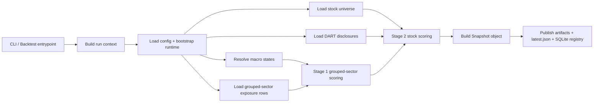
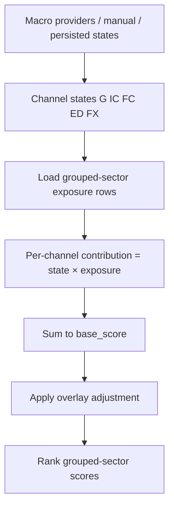
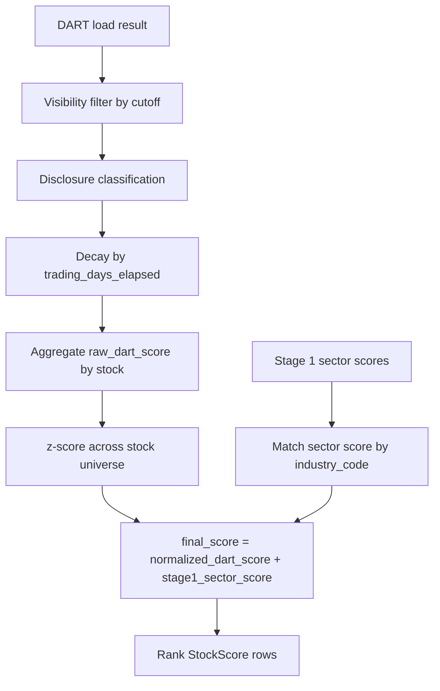
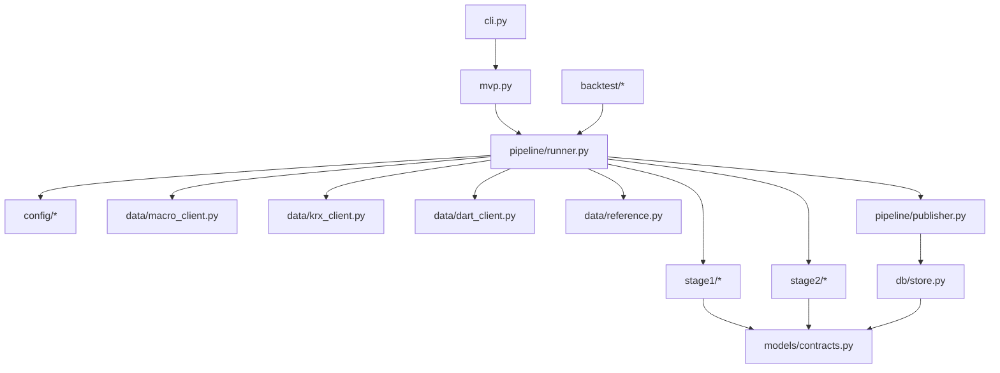

# macro-screener

[한국어 버전](README.ko.md)

`macro-screener` is a batch Korean equity screener for the Korean common-stock universe.
The current codebase implements a **sector-v2** runtime that:

1. resolves macro channel states,
2. converts them into **grouped-sector** scores,
3. scores the full stock universe from DART disclosures,
4. adds the matched Stage 1 sector context to each stock,
5. publishes an immutable snapshot plus registry metadata.

This README is intentionally broader than a quickstart. It is meant to explain:
- what data the program uses,
- where each provider fits,
- how scores are calculated,
- how the runtime flows through the code,
- where outputs and state are written,
- and what to read next if you need deeper context.

If you want the main context set for another engineer or agent, start with:
- `doc/program-context.md`
- `doc/repository-orientation.md`
- `doc/code-context.md`

---

## 1. What the program is and is not

This repository is a **snapshot-publishing screener**, not a portfolio engine.
It ranks sectors and stocks and publishes the result for downstream inspection or consumption.
It does **not** decide position sizes, place orders, or run as an intraday always-on service.

Current scope:
- Korean equity screening
- KOSPI + KOSDAQ common-stock universe
- batch/manual/scheduled execution
- backtest execution through the same pipeline family
- immutable snapshot outputs
- grouped-sector Stage 1 scoring
- DART-driven Stage 2 stock scoring

Out of scope:
- portfolio construction
- order execution
- real-time monitoring UI
- news/NLP-heavy interpretation layer
- global multi-country macro coverage beyond the current Korea/US setup

---

## 2. High-level runtime model

The runtime is orchestrated in `src/macro_screener/pipeline/runner.py`.
At a high level it behaves like this:



Main entrypoints:
- `show-config`
- `demo-run`
- `manual-run`
- `scheduled-run`
- `backtest-run`
- `backtest-stub`

Primary code paths:
- CLI: `src/macro_screener/cli.py`
- Runtime orchestration: `src/macro_screener/pipeline/runner.py`
- Publication: `src/macro_screener/pipeline/publisher.py`
- Macro adapters: `src/macro_screener/data/macro_client.py`
- KRX universe adapter: `src/macro_screener/data/krx_client.py`
- DART adapter: `src/macro_screener/data/dart_client.py`
- Reference taxonomy/exposure helpers: `src/macro_screener/data/reference.py`
- Stage 1 scoring: `src/macro_screener/stage1/ranking.py`
- Stage 2 scoring: `src/macro_screener/stage2/ranking.py`

---

## 3. Current model in plain English

### Stage 1
Stage 1 takes five macro channel states:
- `G` — Growth / Activity
- `IC` — Inflation / Cost
- `FC` — Financial Conditions
- `ED` — External Demand
- `FX` — Foreign Exchange

The current codebase uses:
- config version: `sector-v2`
- grouped-sector exposure artifact: `config/macro_sector_exposure.v2.json`
- grouped-sector taxonomy helpers: `src/macro_screener/data/reference.py`
- active scoring path: **direct channel-state × grouped-sector exposure multiplication**

Important compatibility note:
- the model and artifact filenames still use `industry_*` names in many places,
- but the business concept is now **grouped sector** rather than the older rank-table industry abstraction.

### Stage 2
Stage 2:
- runs on the **full stock universe**,
- classifies DART disclosure events,
- applies decay by trading days elapsed,
- aggregates the raw DART score per stock,
- z-scores the DART component across the universe,
- and then adds the matched Stage 1 sector score.

Current final stock-score contract:

```text
final_score = normalized_dart_score + stage1_sector_score
```

Compatibility note:
- `normalized_financial_score` is still present in the model contract,
- but the current Stage 2 runtime sets it to `0.0`.

---

## 4. Data sources and what each one is used for

### 4.1 Macro providers

| Provider | Role in current code | Used for | Current runtime status |
|---|---|---|---|
| `ECOS` | Korea macro/statistical source | Korea-side macro channel series | active |
| `FRED` | US macro source | US-side macro channel series | active |
| `KOSIS` | optional Korea statistical source | optional Korea external-demand live path | conditional |
| `ALFRED` | US historical/vintage-aware path | historical/backfill-oriented support path | partial / planned |
| `BIS` | not used in main runtime | reference / future expansion only | inactive |
| `OECD` | not used in main runtime | reference / future expansion only | inactive |
| `IMF` | not used in main runtime | reference / future expansion only | inactive |

### 4.2 Market / universe provider

| Provider | Role | Used for | Runtime status |
|---|---|---|---|
| `KRX` | market/universe provider | live stock master data, stock universe construction, taxonomy join | active |

### 4.3 Disclosure provider

| Provider | Role | Used for | Runtime status |
|---|---|---|---|
| `DART` | disclosure provider | Stage 2 disclosures and cursor/cache state | active |

### 4.4 Local reference inputs

| Local file | Purpose |
|---|---|
| `config/default.yaml` | runtime defaults, policies, paths, decay parameters |
| `config/macro_sector_exposure.v2.json` | grouped-sector exposure artifact for Stage 1 |
| `stock_classification.csv` | local stock classification authority |
| `data/reference/industry_master.csv` | derived grouped-sector reference artifact built from the classification file |

---

## 5. Macro data usage and channel construction

The macro layer is defined in `src/macro_screener/data/macro_client.py`.
The code keeps a fixed roster of channel series via `FIXED_CHANNEL_SERIES_ROSTER` and classifies values through `FIXED_SERIES_CLASSIFIER_SPECS`.

### 5.1 Channel roster

| Channel | Korea-side series | US-side series | Degraded fallback |
|---|---|---|---|
| `G` | `kr_ipi_yoy_3mma` | `us_ipi_yoy_3mma` | none |
| `IC` | `kr_cpi_yoy_3mma` | `us_cpi_yoy_3mma` | none |
| `FC` | `kr_credit_spread_z36` | `us_credit_spread_z36` | none |
| `ED` | `kr_exports_us_yoy_3mma` | `us_real_imports_goods_yoy_3mma` | `us_real_pce_goods_yoy_3mma` |
| `FX` | `usdkrw_3m_log_return` | `broad_usd_3m_log_return` | none |

### 5.2 Fixed classification cutoffs

| Series | Positive cutoff | Negative cutoff | Positive means |
|---|---:|---:|---|
| `kr_ipi_yoy_3mma` | `1.0` | `-1.0` | higher |
| `us_ipi_yoy_3mma` | `1.0` | `-1.0` | higher |
| `kr_cpi_yoy_3mma` | `2.75` | `1.25` | higher |
| `us_cpi_yoy_3mma` | `2.75` | `1.25` | higher |
| `kr_credit_spread_z36` | `-0.5` | `0.5` | lower |
| `us_credit_spread_z36` | `-0.5` | `0.5` | lower |
| `kr_exports_us_yoy_3mma` | `2.0` | `-2.0` | higher |
| `us_real_imports_goods_yoy_3mma` | `1.5` | `-1.5` | higher |
| `us_real_pce_goods_yoy_3mma` | `1.5` | `-1.5` | higher |
| `usdkrw_3m_log_return` | `2.5` | `-2.5` | higher |
| `broad_usd_3m_log_return` | `2.0` | `-2.0` | higher |

### 5.3 Channel-state calculation method

Per-series values are first classified to `-1 / 0 / +1`.
Then the channel combines its available fixed signals by arithmetic mean.
Finally the combined score is compared to the neutral band from `DEFAULT_NEUTRAL_BANDS`.

Conceptually:

```text
combined_score_c = average(signal_state_i for series in channel c)
state_c = +1 if combined_score_c > neutral_band_c
state_c =  0 if -neutral_band_c <= combined_score_c <= neutral_band_c
state_c = -1 if combined_score_c < -neutral_band_c
```

Current neutral bands:
- `G`: `0.25`
- `IC`: `0.25`
- `FC`: `0.25`
- `ED`: `0.25`
- `FX`: `0.50`

### 5.4 Macro source selection behavior

The runtime can resolve macro states from:
- explicit manual channel overrides,
- configured manual states,
- persisted last-known channel states,
- live provider payloads.

In the current runner implementation:
- `manual-run` defaults to the live/provider path unless overridden,
- `scheduled-run` also uses the live/provider path,
- demo mode uses the built-in demo states,
- fallback metadata is preserved rather than silently treated as neutral.

---

## 6. Stage 1 grouped-sector scoring

The grouped-sector roster and exposure matrix live in `src/macro_screener/data/reference.py`.
The KRX adapter loads `config/macro_sector_exposure.v2.json`, validates its channels and sector coverage, and converts it into Stage 1 exposure rows.

### 6.1 What a Stage 1 row contains
Each grouped-sector row contains:
- `industry_code` (legacy-compatible name)
- `industry_name`
- `exposures` keyed by `G`, `IC`, `FC`, `ED`, `FX`

### 6.2 Active scoring method

`src/macro_screener/stage1/ranking.py` computes:
1. one channel score map per channel,
2. channel contribution = `channel_state × sector_exposure[channel]`,
3. base score = sum of all channel contributions,
4. overlay adjustment from `src/macro_screener/stage1/overlay.py`,
5. final score = `base_score + overlay_adjustment`,
6. ranking by final score, then tie-breakers.

Conceptually:

```text
sector_base_score = Σ(channel_state[c] * sector_exposure[c])
sector_final_score = sector_base_score + overlay_adjustment
```

### 6.3 Stage 1 flow



---

## 7. Stock-universe data usage

The stock-universe logic lives in `src/macro_screener/data/krx_client.py`.

The runtime can construct stock rows from:
- live KRX master-download data,
- taxonomy-only fallback using `stock_classification.csv`,
- demo fallback in demo mode.

### 7.1 Universe build behavior

The live path:
1. fetches live stock-master rows,
2. normalizes them,
3. joins them against the local stock-classification mapping,
4. filters out non-common equity patterns such as ETF/ETN/REIT/SPAC,
5. emits stock rows with `stock_code`, `stock_name`, `industry_code`, `industry_name`.

### 7.2 Taxonomy mapping behavior

Grouped-sector mapping is derived through `map_classification_row_to_grouped_sector(...)` in `src/macro_screener/data/reference.py`.

Practical caveat:
- the grouped-sector roster contains 26 named sectors,
- but the materialized `industry_master.csv` can contain fewer rows if the current classification file does not populate every grouped-sector bucket.
- for example, the current classification-derived materialization does not necessarily populate every defined grouped sector.

### 7.3 Special overrides
The KRX adapter currently includes a tiny `STOCK_CODE_SECTOR_OVERRIDES` map for stock codes that need sector assignment when taxonomy rows are missing.

---

## 8. DART data usage and Stage 2 calculation

DART logic lives in `src/macro_screener/data/dart_client.py`, `src/macro_screener/stage2/classifier.py`, `src/macro_screener/stage2/decay.py`, and `src/macro_screener/stage2/ranking.py`.

### 8.1 DART load modes

The DART client supports:
- local file input when allowed,
- live API pagination with structured cursor state,
- stale-cache fallback when allowed,
- demo fallback when no configured live path is available.

### 8.2 Cursor and cutoff behavior

The live DART path:
- paginates `https://opendart.fss.or.kr/api/list.json`,
- normalizes each item into a stock/event record,
- computes `accepted_at` relative to the current cutoff,
- filters disclosures by visibility at `input_cutoff`,
- persists a structured cursor with fields such as `accepted_at`, `input_cutoff`, `rcept_dt`, `rcept_no`.

This means the runtime is cutoff-aware rather than just “load all filings for the date”.

### 8.3 Disclosure classification rules

The classifier maps event codes and title patterns into blocks such as:
- `supply_contract`
- `treasury_stock`
- `facility_investment`
- `dilutive_financing`
- `correction_cancellation_withdrawal`
- `governance_risk`
- `neutral`
- `ignored`

Examples:
- `B01` → `supply_contract`
- `N01` → `dilutive_financing`
- titles containing `정정`, `취소`, `철회` → `correction_cancellation_withdrawal`
- routine report titles like `사업보고서`, `분기보고서`, `감사보고서` → `ignored`

### 8.4 Block weights and half-lives

| Block | Weight | Half-life |
|---|---:|---:|
| `supply_contract` | `1.0` | `20` |
| `treasury_stock` | `0.8` | `10` |
| `facility_investment` | `0.6` | `60` |
| `dilutive_financing` | `-1.0` | `60` |
| `correction_cancellation_withdrawal` | `-0.7` | `10` |
| `governance_risk` | `-0.9` | `120` |
| `neutral` | `0.0` | n/a |

Decay formula:

```text
decayed_score = block_weight * exp(-ln(2) * trading_days_elapsed / half_life)
```

### 8.5 Stage 2 calculation method

For each stock:
1. collect visible disclosures,
2. classify each disclosure,
3. decay each classified event,
4. sum to `raw_dart_score`,
5. z-score `raw_dart_score` across the stock universe,
6. read the stock’s matched `stage1_sector_score`,
7. compute final score as `normalized_dart_score + stage1_sector_score`.

Stage 2 also:
- keeps `raw_industry_score` / `stage1_sector_score`,
- records `risk_flags` for adverse blocks,
- warns if the unknown/neutral ratio exceeds `unknown_dart_ratio_warning_threshold`.

### 8.6 Stage 2 flow



---

## 9. Publication, output files, and state

Publication is handled by `src/macro_screener/pipeline/publisher.py`.
The runtime writes:
- parquet outputs,
- CSV outputs,
- JSON views,
- a full `snapshot.json`,
- `latest.json` when status is publishable,
- SQLite registry rows via `src/macro_screener/db/store.py`.

### 9.1 Important output files

Current published artifact filenames include:
- `industry_scores.csv`
- `industry_scores.parquet`
- `screened_stock_list.csv`
- `screened_stocks_by_score.json`
- `screened_stocks_by_industry.json`
- `snapshot.json`
- `stock_scores.parquet`

Compatibility note:
- `industry_*` filenames are intentionally retained even though the taxonomy concept is grouped sector.

### 9.2 Important path behavior

Default config paths say `data/...`, but those paths are resolved against the chosen output root.
The CLI default output root is `repo_root/src`, so a default CLI run publishes under:
- `src/data/snapshots/...`
- `src/data/cache/dart/...`
- `src/data/macro_screener.sqlite3`

### 9.3 Registry/state behavior

The SQLite registry stores:
- snapshot records,
- publication records for scheduled windows,
- ingestion watermarks,
- channel-state snapshots.

This is why a clean run is more than just process exit `0`.
A meaningful successful run should also create the snapshot directory, write `snapshot.json`, and update registry/latest state as allowed by the current mode/status.

---

## 10. Code structure map



---

## 11. Practical verification commands

```bash
PYTHONPATH=src:. python -m macro_screener show-config
PYTHONPATH=src:. python -m macro_screener demo-run
PYTHONPATH=src:. python -m macro_screener manual-run
PYTHONPATH=src:. python -m macro_screener scheduled-run
PYTHONPATH=src:. pytest -q
```

Useful focused checks:
```bash
PYTHONPATH=src:. pytest -q tests/test_manual_run_ids.py
PYTHONPATH=src:. python -m macro_screener demo-run --output-dir /tmp/macro-demo
```

---

## 12. What to read next

- `doc/program-context.md` — fuller runtime behavior and execution semantics
- `doc/repository-orientation.md` — where to look in the repo and why
- `doc/code-context.md` — module boundaries, responsibilities, and code structure
