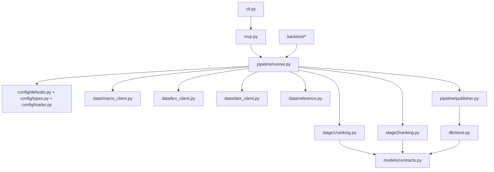

# Code Context

This document is the code-structure map for the current implementation.
Its job is to explain **where logic lives**, **how modules depend on each other**, and **which files matter first** when you need to modify or debug a subsystem.

Use it after:
- `README.md` for the overall system picture
- `doc/program-context.md` for runtime behavior
- `doc/repository-orientation.md` for navigation order

---

## 1. Codebase shape

Important top-level areas:
- `src/macro_screener/` — main application package
- `config/` — runtime defaults and Stage 1 grouped-sector artifact
- `doc/` — human-oriented context docs
- `tests/` — regression coverage
- `data/` — repository-level reference/generated assets

Important runtime nuance:
- the repository uses a `src/` layout,
- the CLI default output root is `repo_root/src`,
- so default runtime outputs land under `src/data/...`.

---

## 2. Module dependency overview



This is the dependency shape that matters most in practice:
- the CLI delegates to the exported runtime/backtest surface,
- the runner stitches together adapters and scoring layers,
- publication and persistence sit downstream of scoring,
- models/contracts provide the shared serialization shape.

---

## 3. Entry-point layer

### 3.1 CLI
File:
- `src/macro_screener/cli.py`

Responsibilities:
- parse arguments
- expose the command set
- define the CLI default output root (`repo_root()/src`)
- call the correct runtime function
- print machine-readable JSON summaries plus full result payloads

Why it matters:
- this file defines what operators can run directly,
- and it explains why outputs land under `src/data/...` by default.

### 3.2 Export surface / compatibility layer
File:
- `src/macro_screener/mvp.py`

Responsibilities:
- re-export the public runtime/backtest surface
- group together stage helpers, pipeline helpers, demo defaults, and backtest helpers

Why it matters:
- the CLI imports from here,
- and this file is a good high-level map of what the project considers public runtime functionality.

---

## 4. Configuration layer

Files:
- `src/macro_screener/config/defaults.py`
- `src/macro_screener/config/types.py`
- `src/macro_screener/config/loader.py`
- `config/default.yaml`

Responsibilities:
- define default configuration values
- define typed config objects
- load/merge config from YAML
- resolve repo-relative paths

Important current config facts:
- `config_version` is `sector-v2`
- Stage 1 artifact path defaults to `config/macro_sector_exposure.v2.json`
- Stage 2 half-lives live in config/defaults/types
- runtime policy flags such as stale-cache/manual-macro allowances live here

Why it matters:
- many runtime behaviors that look “hard-coded” are actually policy/config decisions surfaced through this layer.

---

## 5. Runtime orchestration layer

### 5.1 Runner
File:
- `src/macro_screener/pipeline/runner.py`

This is the central file of the system.
It owns:
- context construction for manual/demo/scheduled execution
- macro-state resolution and policy enforcement
- Stage 1 row loading
- stock-universe loading
- DART loading
- Stage 1 + Stage 2 composition
- snapshot assembly
- publication retry/cleanup flow

Key functions to know:
- `build_manual_context(...)`
- `build_demo_snapshot(...)`
- `run_pipeline_context(...)`
- `run_manual(...)`
- `run_demo(...)`
- `run_scheduled(...)`
- `run_scheduled_stub(...)`

### 5.2 Runtime bootstrap
File:
- `src/macro_screener/pipeline/runtime.py`

Responsibilities:
- create runtime directories
- initialize the SQLite store
- establish the output-root contract for runtime artifacts

### 5.3 Scheduler helpers
File:
- `src/macro_screener/pipeline/scheduler.py`

Responsibilities:
- define scheduled run times
- build scheduled-window keys
- derive scheduled run contexts and cutoffs

Why the pipeline layer matters:
- this is where data-source policy, degradation behavior, and publish/no-publish logic all meet.

---

## 6. Data-adapter layer

### 6.1 Macro adapter
File:
- `src/macro_screener/data/macro_client.py`

Responsibilities:
- define the fixed macro-series roster per channel
- define the fixed classification cutoffs per series
- classify provider payloads to `MacroSeriesSignal`
- combine signals into channel states
- preserve confidence/fallback/warning metadata
- support manual, persisted, and live-style macro sources

Key constructs:
- `FIXED_CHANNEL_SERIES_ROSTER`
- `FIXED_SERIES_CLASSIFIER_SPECS`
- `MacroLoadResult`
- `LiveMacroDataSource`
- `ManualMacroDataSource`
- `PersistedMacroDataSource`

Why it matters:
- this is the code authority for how macro data is turned into the five-channel state vector.

### 6.2 KRX adapter
File:
- `src/macro_screener/data/krx_client.py`

Responsibilities:
- define demo stock/exposure rows
- validate and load grouped-sector exposure rows from the artifact JSON
- load stock classification input
- normalize live stock-master records
- filter non-common equity
- join live rows to grouped-sector taxonomy
- supply taxonomy-only fallback rows when needed

Important implementation details:
- the adapter validates that exposure rows cover the expected channels and grouped sectors
- stock rows carry both `industry_code` and `industry_name`
- the adapter has a small stock-code override map for missing taxonomy rows

### 6.3 DART adapter
File:
- `src/macro_screener/data/dart_client.py`

Responsibilities:
- load disclosures from local file, live API, stale cache, or demo fallback
- normalize live DART items into the runtime schema
- apply cutoff visibility filtering
- maintain a structured cursor/watermark model
- write/read cache files

Important implementation details:
- live DART handling is pagination-aware
- the cursor is richer than a single timestamp
- local file inputs are policy-controlled
- stale-cache behavior is explicit rather than hidden

### 6.4 Reference-data helper layer
File:
- `src/macro_screener/data/reference.py`

Responsibilities:
- define the grouped-sector roster
- define `GROUPED_SECTOR_EXPOSURE_MATRIX`
- map classification labels to grouped sectors
- build stock-sector rows
- build and write `industry_master.csv`
- build and write the Stage 1 artifact JSON

Why it matters:
- this file is the taxonomy authority of the current grouped-sector model.

---

## 7. Stage 1 code structure

### 7.1 Main scoring logic
File:
- `src/macro_screener/stage1/ranking.py`

Responsibilities:
- validate that all five channel states are present
- build the per-channel score map
- compute channel contributions by sector
- apply overlay adjustments
- rank sectors and create `IndustryScore` objects
- return `Stage1Result`

Important reality:
- the active path is **direct exposure multiplication**
- compatibility parameters such as `sector_rank_tables` and `channel_weights` still exist in the function signature,
- but the current implementation does not use them for scoring
- output names remain `IndustryScore` / `industry_scores` for compatibility

### 7.2 Supporting Stage 1 modules
- `src/macro_screener/stage1/channel_state.py`
  - builds `ChannelState` records with metadata
- `src/macro_screener/stage1/overlay.py`
  - resolves overlay adjustments
- `src/macro_screener/stage1/base_score.py`
  - supporting score helpers

---

## 8. Stage 2 code structure

### 8.1 Main stock-scoring logic
File:
- `src/macro_screener/stage2/ranking.py`

Responsibilities:
- group disclosures by stock
- classify them to block names
- compute decayed contributions
- aggregate raw DART scores
- z-score the DART and sector components where needed
- combine the normalized DART component with the matched Stage 1 sector score
- rank final stock rows and emit `StockScore` objects

Current final-score contract:

```text
final_score = normalized_dart_score + stage1_sector_score
```

### 8.2 Supporting Stage 2 modules
- `src/macro_screener/stage2/classifier.py`
  - event-code map, title-pattern map, ignored-title rules
- `src/macro_screener/stage2/decay.py`
  - signed block weights, half-lives, exponential decay
- `src/macro_screener/stage2/normalize.py`
  - z-score helper

Why this split matters:
- ranking.py owns orchestration,
- classifier.py owns semantic bucketing,
- decay.py owns time-decay semantics,
- normalize.py owns cross-sectional standardization.

---

## 9. Model/contract layer

File:
- `src/macro_screener/models/contracts.py`

This file defines the shared serialized shapes used across runtime, storage, and publication.
Important contracts include:
- `RunType`
- `RunMode`
- `SnapshotStatus`
- `ScheduledWindowKey`
- `ChannelState`
- `IndustryScore`
- `Stage1Result`
- `StockScore`
- `Snapshot`

Important compatibility details:
- `IndustryScore` and `industry_scores` naming remains even though grouped sector is the active business concept
- `StockScore` retains fields that are not fully active in the present runtime, such as `normalized_financial_score`

Why it matters:
- if a change breaks serialization, publication, or downstream artifact shape, this is one of the first files to inspect.

---

## 10. Persistence layer

File:
- `src/macro_screener/db/store.py`

Responsibilities:
- initialize the SQLite schema
- persist snapshots
- register scheduled-window publications
- persist ingestion watermarks
- persist channel-state snapshots
- load last-known macro state snapshots

Important tables include:
- `snapshots`
- `published_snapshots`
- `ingestion_watermarks`
- `channel_state_snapshots`

Why it matters:
- degraded/live behavior, deduplication, and “what happened last run?” questions often end here.

---

## 11. Publication layer

File:
- `src/macro_screener/pipeline/publisher.py`

Responsibilities:
- build per-run artifact paths
- write parquet/CSV/JSON outputs
- write `snapshot.json`
- update SQLite snapshot state
- update `latest.json`

Important implementation detail:
- nested values are normalized before parquet write so nested dict/list fields do not break parquet serialization.

Why it matters:
- this is the file to inspect when the snapshot object exists but artifacts look incomplete, malformed, or missing.

---

## 12. Backtest layer

Files:
- `src/macro_screener/backtest/engine.py`
- `src/macro_screener/backtest/calendar.py`
- `src/macro_screener/backtest/snapshot_store.py`

Responsibilities:
- build trading-date plans for backtests
- derive previous trading days and trading-date iteration
- create the backtest output-root convention
- reuse the main pipeline for each planned run

Why it matters:
- backtest code is not a separate scoring engine; it is a planning/execution wrapper around the same runtime pipeline.

---

## 13. Subsystem-based debugging map

### If macro data is wrong
Open:
1. `data/macro_client.py`
2. `pipeline/runner.py`
3. `config/default.yaml`

### If Stage 1 is wrong
Open:
1. `stage1/ranking.py`
2. `data/reference.py`
3. `config/macro_sector_exposure.v2.json`
4. `stage1/overlay.py`

### If the stock universe is wrong
Open:
1. `data/krx_client.py`
2. `stock_classification.csv`
3. `data/reference.py`
4. `data/reference/industry_master.csv`

### If Stage 2 is wrong
Open:
1. `stage2/ranking.py`
2. `stage2/classifier.py`
3. `stage2/decay.py`
4. `data/dart_client.py`

### If outputs are wrong
Open:
1. `pipeline/publisher.py`
2. `db/store.py`
3. the relevant run directory in `src/data/snapshots/`

---

## 14. First tests to inspect

When you need the fastest behavior checkpoint, start with:
- `tests/test_manual_run_ids.py`
- pipeline/stage-specific regressions nearest the subsystem you are touching

Why `test_manual_run_ids.py` matters:
- the manual run-id shape is now timestamped and suffixed to avoid collisions,
- and that affects how operators and tests reason about output directories.
