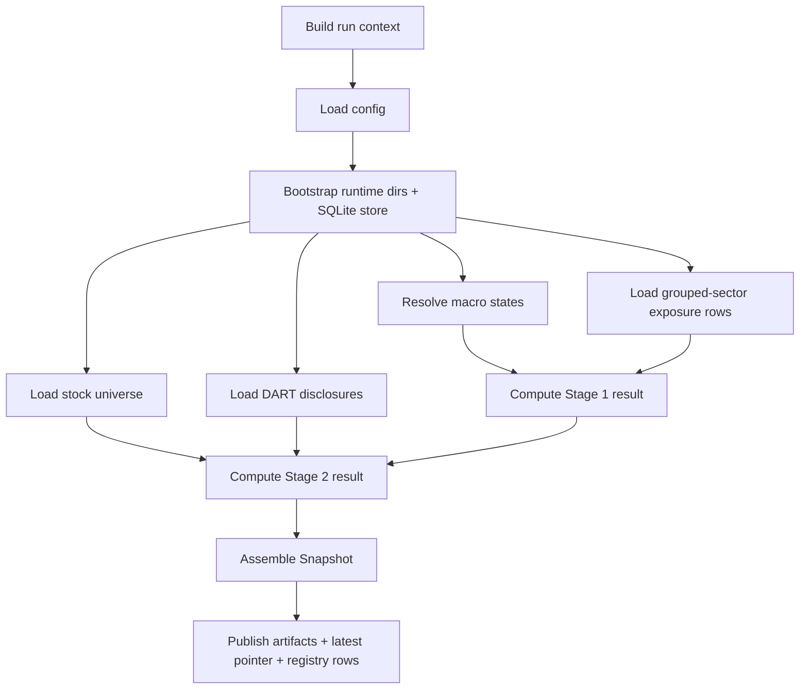

# Program Context: macro-screener

This document is the runtime-oriented explanation of the current codebase.
It is meant to answer the questions below without forcing the reader to reconstruct behavior from many files first:
- what the program does,
- which runtime modes exist,
- which data sources are active,
- how Stage 1 and Stage 2 calculations work,
- what fallback/degraded paths exist,
- what gets published and persisted,
- and where practical debugging should begin.

Use it together with:
- `doc/repository-orientation.md` for repository navigation
- `doc/code-context.md` for module boundaries and code structure

---

## 1. What this repository is

`macro-screener` is a **batch Korean equity screener**.
The current implementation ranks grouped sectors first and stocks second, then publishes a snapshot.

It is **not**:
- a portfolio construction engine,
- an execution engine,
- an intraday monitoring service,
- a public API server,
- a real-time trading decision system.

It is a **snapshot-publishing ranking pipeline**.
The main job is to turn a run context plus data inputs into a reproducible published snapshot.

---

## 2. End-to-end runtime flow

The main runtime orchestration lives in `src/macro_screener/pipeline/runner.py`.
The effective flow is:



A normal `run_pipeline_context(...)` call does the following in order:
1. resolve config and bootstrap directories/store,
2. resolve macro states,
3. enforce source-policy rules for macro input,
4. load grouped-sector exposure rows for Stage 1,
5. load the stock universe,
6. enforce KRX source-policy rules,
7. compute Stage 1 and save channel-state snapshots,
8. load DART disclosures,
9. enforce DART source-policy rules,
10. compute Stage 2 stock scores,
11. assemble a `Snapshot`,
12. publish artifacts and registry state.

---

## 3. Runtime modes and entrypoints

### 3.1 CLI-visible modes
The CLI in `src/macro_screener/cli.py` exposes:
- `show-config`
- `demo-run`
- `manual-run`
- `scheduled-run`
- `backtest-run`
- `backtest-stub`

### 3.2 Runtime execution modes
Internally the pipeline recognizes:
- `RunMode.MANUAL`
- `RunMode.SCHEDULED`
- `RunMode.BACKTEST`

### 3.3 Context builders
Important context-build helpers:
- `build_manual_context(...)`
- `build_scheduled_context(...)`
- `build_backtest_plan(...)`

Their job is to define:
- `run_id`
- `run_type`
- `as_of_timestamp`
- `input_cutoff`
- `published_at`
- and, for scheduled runs, the scheduled-window key used for deduplication.

### 3.4 Scheduled behavior
`src/macro_screener/pipeline/scheduler.py` defines:
- `pre_open` runs at `08:30:00+09:00`
- `post_close` runs at `15:45:00+09:00`

For `pre_open` runs:
- the input cutoff is the previous trading day at `18:00:00+09:00`

For `post_close` runs:
- the input cutoff equals the run timestamp itself.

---

## 4. Data-source model

### 4.1 Active provider paths
The current codebase actively uses these provider families:
- `ECOS` for Korea macro/statistical series
- `FRED` for US macro series
- optional `KOSIS` support for a Korea external-demand live path
- `KRX` for live stock-universe construction
- `DART` for disclosure ingestion

### 4.2 Non-active reference providers
These are not active as primary runtime providers in the current implementation:
- `BIS`
- `OECD`
- `IMF`

### 4.3 Local reference inputs
The runtime also depends on local files:
- `config/default.yaml`
- `config/macro_sector_exposure.v2.json`
- `stock_classification.csv`
- `data/reference/industry_master.csv` (derived reference artifact)

These local inputs are important because provider output alone is not enough:
- the grouped-sector taxonomy is locally defined,
- Stage 1 exposure semantics are locally defined,
- and live stock rows are normalized through local taxonomy joins.

---

## 5. Macro-state resolution

Macro-state resolution is handled by `src/macro_screener/data/macro_client.py` and coordinated by `_resolve_macro_states(...)` in the runner.

Possible sources:
- explicit manual channel overrides
- configured manual channel states from `config/default.yaml`
- persisted last-known channel states from SQLite
- live provider payloads
- demo defaults in demo mode

### 5.1 Fixed channel set
The system uses five macro channels:
- `G`
- `IC`
- `FC`
- `ED`
- `FX`

### 5.2 Fixed series roster
Each channel is backed by fixed series IDs defined in `FIXED_CHANNEL_SERIES_ROSTER`.
This is important because the runtime is not “discovering” arbitrary series at runtime; it is applying a fixed classification contract.

### 5.3 Channel-state semantics
Each channel resolves to `-1`, `0`, or `+1`.
Those values are treated as state labels, not arbitrary numeric scores.

### 5.4 Combination method
Per-series signals are classified first.
Then signals inside the same channel are averaged.
Then the average is compared to the neutral band from `DEFAULT_NEUTRAL_BANDS`.

Conceptually:

```text
combined_score = average(per-series states)
state = +1 / 0 / -1 depending on the neutral band comparison
```

### 5.5 Metadata preservation
Macro results keep metadata such as:
- source name
- source version
- warnings
- fallback mode
- confidence by channel
- warning flags by channel
- as-of timestamp
- input cutoff

This matters because degraded or fallback macro states are not supposed to disappear into a silent `0`.

---

## 6. Live/degraded policy behavior

The runner contains explicit source-policy enforcement:
- `_enforce_macro_source_policy(...)`
- `_enforce_krx_source_policy(...)`
- `_enforce_dart_source_policy(...)`

### 6.1 Live-mode expectation
When `normal_mode=live` and the mode is `manual` or `scheduled`:
- macro states should come from a live/provider-compatible path,
- KRX stock source should be live,
- DART should be live or an allowed degraded path.

### 6.2 Degraded behavior
The runtime can still enter degraded states, for example:
- stale DART cache fallback,
- persisted last-known macro states,
- taxonomy-only stock universe fallback.

When that happens the code tries to preserve the reason through:
- warnings,
- fallback metadata,
- incomplete snapshot status,
- or explicit runtime exceptions depending on policy flags.

---

## 7. Stage 1 in detail

Stage 1 scoring happens in `src/macro_screener/stage1/ranking.py`.
The important current fact is that the active implementation is **not** the older rank-table scoring contract.
It now uses direct grouped-sector exposures.

### 7.1 Inputs
Stage 1 uses:
- resolved macro channel states,
- grouped-sector exposure rows loaded via `KRXClient.load_exposures_result()`,
- overlay adjustments from `src/macro_screener/stage1/overlay.py`.

### 7.2 Calculation method
For each grouped sector:
1. multiply each channel state by that sector’s exposure on that channel,
2. sum those contributions into `base_score`,
3. apply `overlay_adjustment`,
4. rank sectors by `final_score`, then tie-breakers.

### 7.3 Output structure
Stage 1 returns `Stage1Result`, which contains:
- `channel_states`
- `industry_scores`
- `config_version`
- warnings
- channel score metadata

Compatibility note:
- the output still says `industry_scores`, but the current taxonomy concept is grouped sector.

---

## 8. Stock-universe construction in detail

The stock-universe path lives in `src/macro_screener/data/krx_client.py`.

### 8.1 Universe sources
The runtime prefers:
1. live KRX master-download data,
2. local classification joins,
3. taxonomy-only fallback when live rows are unavailable,
4. demo fallback in demo mode.

### 8.2 Filtering and normalization
The KRX adapter:
- normalizes stock codes,
- filters listing status,
- filters non-common equity patterns,
- joins stock rows to grouped-sector taxonomy,
- carries `industry_code` and `industry_name` on each stock row.

### 8.3 Taxonomy caveat
The grouped-sector roster defined in `data/reference.py` is broader than what the current classification file may materialize into `industry_master.csv`.
So “defined sector universe” and “currently populated sector universe” are not always identical.

---

## 9. DART ingestion in detail

DART ingestion lives in `src/macro_screener/data/dart_client.py`.
This part of the pipeline is more than a simple HTTP fetch.

### 9.1 Supported input modes
The DART client can load from:
- local file input when enabled,
- live API pagination,
- stale cache fallback,
- demo fallback.

### 9.2 Cursor model
The code uses `DARTDisclosureCursor`, which preserves:
- `accepted_at`
- `input_cutoff`
- `rcept_dt`
- `rcept_no`

This is more precise than a single timestamp watermark.

### 9.3 Visibility model
The runtime normalizes each item to an `accepted_at` time and filters by `input_cutoff`.
So Stage 2 works on what should be visible at the run’s cutoff, not merely “everything fetched”.

### 9.4 Cache behavior
The runtime can write/read:
- `data/cache/dart/latest.json` relative to the output root

This allows stale-cache degraded behavior when policy allows it.

---

## 10. Stage 2 in detail

Stage 2 scoring happens in `src/macro_screener/stage2/ranking.py`.
Supporting helpers live in:
- `stage2/classifier.py`
- `stage2/decay.py`
- `stage2/normalize.py`

### 10.1 Classification model
Disclosures are classified by:
- explicit event-code map where available,
- title-pattern fallback rules,
- ignore rules for routine report-like filings,
- neutral fallback for unrecognized items.

### 10.2 Weight and decay model
Each block type has:
- a signed weight,
- a half-life,
- and a decayed contribution based on `trading_days_elapsed`.

### 10.3 Stock scoring method
For each stock, the runtime:
1. groups visible disclosures,
2. classifies them,
3. decays them,
4. sums to `raw_dart_score`,
5. z-scores the DART component across the universe,
6. reads the matched Stage 1 sector score,
7. computes `final_score = normalized_dart_score + stage1_sector_score`.

### 10.4 Risk flags and warnings
Stage 2 also records:
- `risk_flags` for negative/high-risk block types,
- per-block score breakdowns,
- a warning if the unknown/neutral ratio gets too high.

---

## 11. Snapshot publication and persistence

Publication is handled by `src/macro_screener/pipeline/publisher.py`.
Persistence is handled by `src/macro_screener/db/store.py`.

### 11.1 What gets written
A published snapshot includes:
- `industry_scores.csv`
- `industry_scores.parquet`
- `screened_stock_list.csv`
- `screened_stocks_by_score.json`
- `screened_stocks_by_industry.json`
- `snapshot.json`
- `stock_scores.parquet`

### 11.2 What the SQLite registry stores
The SQLite registry stores:
- snapshots
- scheduled-window publication records
- ingestion watermarks
- channel-state snapshots

### 11.3 Latest-pointer behavior
`latest.json` is updated only for publishable statuses such as:
- `published`
- `incomplete`

### 11.4 Practical path behavior
Config paths are relative to the chosen output root.
Because the CLI default output root is `repo_root/src`, default CLI outputs land under `src/data/...`.

---

## 12. Backtest behavior

Backtest helpers live in:
- `src/macro_screener/backtest/calendar.py`
- `src/macro_screener/backtest/engine.py`
- `src/macro_screener/backtest/snapshot_store.py`
- re-exported through `src/macro_screener/mvp.py`

Important backtest behavior:
- trading dates are generated from a simple weekday/holiday calendar,
- each trading date becomes a planned run context,
- backtests reuse the main `run_pipeline_context(...)` execution path,
- outputs are written under `.../backtest/<start>_<end>_<run_type>/`.

---

## 13. Practical debugging routes

If something looks wrong, start here:

### “Macro states look wrong”
- `src/macro_screener/data/macro_client.py`
- `config/default.yaml`
- `src/macro_screener/pipeline/runner.py`

### “Stage 1 results look wrong”
- `src/macro_screener/stage1/ranking.py`
- `src/macro_screener/data/reference.py`
- `config/macro_sector_exposure.v2.json`

### “Stage 2 results look wrong”
- `src/macro_screener/stage2/ranking.py`
- `src/macro_screener/stage2/classifier.py`
- `src/macro_screener/stage2/decay.py`
- `src/macro_screener/data/dart_client.py`

### “Artifacts are missing or partial”
- `src/macro_screener/pipeline/publisher.py`
- `src/macro_screener/db/store.py`
- the run directory under `src/data/snapshots/<run_id>/`
- `src/data/snapshots/latest.json`

---

## 14. Common wrong assumptions

- `industry_*` names do not mean the old rank-table industry contract is still the business concept.
- `config/default.yaml` showing `data/...` paths does not mean outputs land under repository-root `data/`; they resolve against the chosen output root.
- a clean process exit is not the same thing as a complete published snapshot.
- DART cache state is cutoff-aware and cursor-aware; it is not just a naive list of “today’s filings”.
