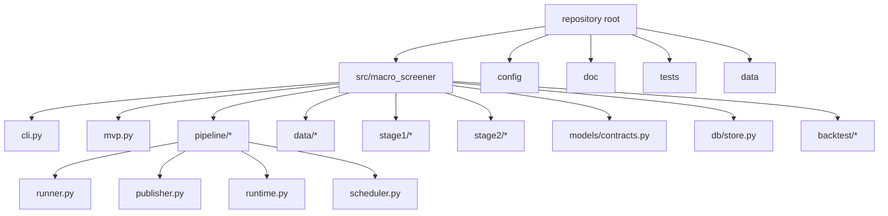

# Repository Orientation

This document is the practical navigation guide for the repository.
Its purpose is to shorten the time between “I need to understand this codebase” and “I know exactly which file to open next”.

Use it after `doc/program-context.md`.
That document explains runtime behavior; this one explains where that behavior lives in the tree.

---

## 1. Recommended reading order

If you want the shortest reliable onboarding path, read in this order:

1. `README.md`
2. `doc/program-context.md`
3. `doc/repository-orientation.md`
4. `doc/code-context.md`
5. then the main executable files:
   - `src/macro_screener/cli.py`
   - `src/macro_screener/pipeline/runner.py`
   - `src/macro_screener/pipeline/publisher.py`

If you are debugging a specific subsystem, skip to the relevant sections below.

---

## 2. Top-level directories and what they mean

### `src/macro_screener/`
Main application package.
Contains the runtime entrypoints, adapters, Stage 1/Stage 2 logic, contracts, persistence, and backtest helpers.

### `config/`
Configuration and Stage 1 artifact location.
Currently most important files are:
- `config/default.yaml`
- `config/macro_sector_exposure.v2.json`

### `doc/`
Human-oriented context and navigation docs.
The preferred compact context set is:
- `doc/program-context.md`
- `doc/repository-orientation.md`
- `doc/code-context.md`

### `tests/`
Regression and behavior checks.
Open this when you need to know what is expected, not just what the code currently appears to do.

### `data/`
Repository-level reference/generated data area.
Important nuance:
- config paths use `data/...`,
- but the CLI default output root is `repo_root/src`,
- so default runtime outputs still land under `src/data/...`.

### `src/data/`
Default runtime output root when the CLI default is used.
This is where snapshot artifacts, DART cache, logs, and SQLite files usually appear during default CLI execution.

---

## 3. Main executable entrypoints

### CLI surface
File:
- `src/macro_screener/cli.py`

Use this when you need to understand:
- the available commands,
- command-line arguments,
- the default output root,
- summary/result JSON formatting.

### Main runtime orchestrator
File:
- `src/macro_screener/pipeline/runner.py`

Use this when you need to understand:
- end-to-end pipeline order,
- how providers are loaded,
- where policy enforcement happens,
- how Stage 1 and Stage 2 are stitched together,
- when snapshots become `published` vs `incomplete`.

### Publication contract
File:
- `src/macro_screener/pipeline/publisher.py`

Use this when you need to understand:
- which files are written,
- how parquet/CSV/JSON outputs are built,
- how `latest.json` is updated,
- and which filenames remain legacy-compatible.

### Backtest execution family
Files:
- `src/macro_screener/mvp.py`
- `src/macro_screener/backtest/engine.py`
- `src/macro_screener/backtest/calendar.py`
- `src/macro_screener/backtest/snapshot_store.py`

Use these when you need to understand:
- how backtest plans are generated,
- how trading days are iterated,
- how backtest outputs are organized,
- how backtests reuse the main pipeline.

---

## 4. Input map

### 4.1 Runtime configuration
- `config/default.yaml`
  - runtime policy flags
  - path configuration
  - neutral bands
  - decay settings
  - API key env names

### 4.2 Stage 1 artifact and taxonomy
- `config/macro_sector_exposure.v2.json`
  - grouped-sector exposure artifact
- `stock_classification.csv`
  - stock classification authority
- `data/reference/industry_master.csv`
  - derived grouped-sector reference artifact
- `src/macro_screener/data/reference.py`
  - grouped-sector roster, mapping helpers, artifact builders

### 4.3 Provider adapters
- `src/macro_screener/data/macro_client.py`
  - macro-series roster, provider payload handling, channel-state construction
- `src/macro_screener/data/krx_client.py`
  - live/taxonomy/demo stock-universe loading and grouped-sector joins
- `src/macro_screener/data/dart_client.py`
  - DART live/file/cache loading plus structured watermark logic

### 4.4 Stage logic
- `src/macro_screener/stage1/`
  - grouped-sector scoring, overlays, channel-state record construction
- `src/macro_screener/stage2/`
  - disclosure classification, decay, normalization, stock ranking

### 4.5 Persistence
- `src/macro_screener/db/store.py`
  - SQLite registry, publication deduplication, watermarks, channel-state snapshots

---

## 5. Output and state map

With the default CLI output root, runtime artifacts are written under `src/data/`.

Important default locations in practice:
- snapshot root: `src/data/snapshots/<run_id>/`
- latest pointer: `src/data/snapshots/latest.json`
- DART cache: `src/data/cache/dart/latest.json`
- SQLite registry: `src/data/macro_screener.sqlite3`
- logs directory: `src/data/logs/`

Published artifact filenames currently include:
- `industry_scores.csv`
- `industry_scores.parquet`
- `screened_stock_list.csv`
- `screened_stocks_by_score.json`
- `screened_stocks_by_industry.json`
- `snapshot.json`
- `stock_scores.parquet`

Compatibility note:
- `industry_*` naming remains even though the active taxonomy concept is grouped sector.

---

## 6. File-opening routes by question

### “How does the runtime actually execute?”
Open in this order:
1. `src/macro_screener/pipeline/runner.py`
2. `src/macro_screener/pipeline/runtime.py`
3. `src/macro_screener/pipeline/publisher.py`

### “Where do macro states come from?”
Open in this order:
1. `src/macro_screener/data/macro_client.py`
2. `config/default.yaml`
3. `src/macro_screener/pipeline/runner.py`

### “How is Stage 1 calculated?”
Open in this order:
1. `src/macro_screener/stage1/ranking.py`
2. `src/macro_screener/data/reference.py`
3. `config/macro_sector_exposure.v2.json`
4. `src/macro_screener/stage1/overlay.py`

### “How is the stock universe built?”
Open in this order:
1. `src/macro_screener/data/krx_client.py`
2. `stock_classification.csv`
3. `src/macro_screener/data/reference.py`
4. `data/reference/industry_master.csv`

### “How is Stage 2 calculated?”
Open in this order:
1. `src/macro_screener/stage2/ranking.py`
2. `src/macro_screener/stage2/classifier.py`
3. `src/macro_screener/stage2/decay.py`
4. `src/macro_screener/stage2/normalize.py`
5. `src/macro_screener/data/dart_client.py`

### “Why is a run incomplete or degraded?”
Open in this order:
1. `src/macro_screener/pipeline/runner.py`
2. `src/macro_screener/data/dart_client.py`
3. `src/macro_screener/data/macro_client.py`
4. `src/macro_screener/data/krx_client.py`

### “Why are outputs missing?”
Open in this order:
1. `src/macro_screener/pipeline/publisher.py`
2. `src/macro_screener/db/store.py`
3. the specific run directory under `src/data/snapshots/<run_id>/`
4. `src/data/snapshots/latest.json`

---

## 7. Repository structure diagram

---

## 8. Common navigation mistakes

### Mistake 1
“`data/` in the config means outputs are written to repository-root `data/`.”

Reality:
- those are relative config paths,
- and the CLI default output root is `src`,
- so default CLI outputs land under `src/data/...`.

### Mistake 2
“Backtest behavior must be separate from the main runtime.”

Reality:
- backtest planning lives under `backtest/`,
- but actual run execution still reuses `run_pipeline_context(...)`.

### Mistake 3
“Stage 1 must still be the old rank-table path because of the `industry_*` names.”

Reality:
- current active scoring is grouped-sector exposure multiplication,
- and `industry_*` survives mainly for compatibility.

### Mistake 4
“DART cache is just a dump of today’s filings.”

Reality:
- it is cutoff-aware, cursor-aware, and policy-aware.

---

## 9. Fast handoff package for another engineer or agent

If you want to hand this repository to another engineer or AI with the smallest practical context set, send:
- `README.md`
- `doc/program-context.md`
- `doc/repository-orientation.md`
- `doc/code-context.md`

Then, depending on the task, add one of:
- `src/macro_screener/pipeline/runner.py` for runtime/debugging tasks
- `src/macro_screener/stage1/ranking.py` for Stage 1 tasks
- `src/macro_screener/stage2/ranking.py` for Stage 2 tasks
- `src/macro_screener/data/dart_client.py` for disclosure-ingestion tasks
